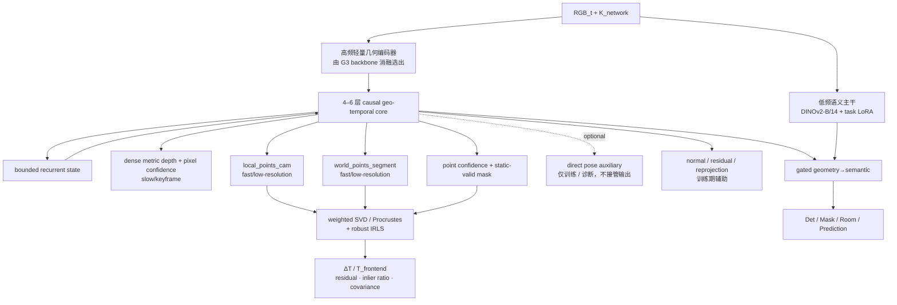

# 学生模型选型与 point-map VO 端侧架构

> 本文只回答：**学生模型选什么、为何这样选、接口是什么、按什么阶段验证，以及达到什么条件才能冻结。**
>
> 教师选择见 [[01_教师模型选型与目标域审计]]；蒸馏损失和训练方法见 [[03_蒸馏方法与训练验证方案]]；综合历史方案见 [[22_DINO-GeoSemMap_v-next.2_深度与几何多教师蒸馏方案]]。
>
> 固定 P0 训练架构：[[DINO-GeoSemMap_v-next.2_深度与Pi3位姿多教师蒸馏架构.drawio|深度与 Pi3X 点图多教师蒸馏架构]]；部署形态草图：[[DINO-GeoSemMap_v-next.2_端侧主干专家架构.drawio]]。后者仍是早期草图，接口与速率以本文为准。

> [!tip] 一句话理解
> 一张 point map 相当于给每个像素附上一个三维坐标。`local_points_cam` 表示“这个点在当前相机前方哪里”，`world_points_segment` 表示“同一个点在公共空间里哪里”。把大量同像素点对做置信度加权刚体对齐，就能反推出相机位姿。只要 local point 使用米为单位且相机坐标约定为 Z 轴朝前，`local_points_cam[...,2]` 就是通常所说的 z-depth；点的欧氏范数则是沿视线的 range，二者不能混用。

---

## 0. 选型结论卡

学生不应在第一轮直接冻结为一个“大而全”的最终模型，而应分三步：

| 阶段                         | 当前选择                                                                                                                         | 回答的问题                                                  | 不允许声称的结论                                                          |
| -------------------------- | ---------------------------------------------------------------------------------------------------------------------------- | ------------------------------------------------------ | ----------------------------------------------------------------- |
| **P0a：单帧验证学生**             | DINOv2-B/14 + 私有 Geo-Adapter/Geo-LoRA + DPT-Lite + metric depth/confidence；由 $K$ 反投影 local point，normal/residual head 仅训练期   | 更好的米制深度/local geometry 监督是否有效，现有 frozen feature 是否足够   | 不能宣称已经学会 world point、位姿或 VO                                       |
| **P0b：最小 point-map VO 学生** | P0a 胜出表征 + 2–4 层 causal/pair block + bounded geometry state + local/world point 与 confidence heads + weighted SVD/Procrustes | 因果学生能否复现 `local/world point → camera pose` 主链，并优于当前 V0 | 不能据此直接冻结最终端侧 backbone；direct pose/token 只是可选辅助                    |
| **目标学生**                   | 可选低频语义旁路 + 高频轻量几何编码器 + 4–6 层有界 causal core + metric depth/local/world point/confidence heads + 点图位姿求解器                       | 在目标设备上获得 RGB-only、因果、有界状态的几何 VO 前端                     | backbone 与 state 形式须经同条件 A/B；direct pose head/外露 token 在正式导出中必须删除 |

当前推荐路线：

1. **P0a 首选当前 DINOv2-B/14 + Geo-Adapter**，最大限度减少变量，先判断监督是否有效。
2. **P0b 暂不更换 backbone**，只增加最小因果时序模块、公共坐标状态、local/world point 与 point-confidence 输出，再用加权刚体对齐求位姿，先验证 Pi3X 点图蒸馏。
3. 只有 P0a/P0b 分别通过后，才比较目标几何干：
   - A：DINOv2-B/14 + Geo-Adapter + 4–6 层有界 causal core；
   - B：LingBot-Vision-S/16 等轻量 RGB 几何干 + 4–6 层有界 causal core。
4. **语义主干先保持 DINOv2-B/14**；几何只做单向、门控注入，防止新几何 loss 破坏成熟 Det/Mask/Room 能力。
5. 最终必须保留由 point map 求出的 `delta_T/T_frontend`；`pose_token` 不是公开接口硬要求。若实现使用内部 geometry token，其唯一保留理由是稳定 world point 或改善正式 point-map VO，无独立收益即删除。
6. metric depth 与 `local_points_cam` 必须共享同一几何答案：先由 base depth + $K$ 反投影，可选小型 3D residual 精修；若 residual 改变 Z，最终 `depth_metric` 必须重新取精修后 `local_points_cam[...,2]`。`world_points_segment` 与逐点 confidence 是 P0b/目标学生的核心新增输出。

尚未冻结：目标 NPU、目标 p95 延迟、持续功耗/温控红线、最终几何 backbone、因果状态实现和量化精度。这些不能被早期架构图中的 30–60 Hz 文案替代。

---

## 1. 学生必须满足的系统边界

### 1.1 输入与运行方式

- 主输入为逐帧 RGB；已知 $K$ 优先显式输入，未知内参模式后置验证。
- 严格因果在线：时刻 $t$ 不能依赖 $t+1$ 之后的帧。
- 增量计算，历史状态大小有界；延迟和显存不能随轨迹长度线性增长。
- fast low-resolution point-map + solver path 逐帧运行；slow dense depth/semantic path 在关键帧或较低频率运行。
- 训练可使用离线教师、GT、RGB-D、点图和未来帧上界，但部署学生不得依赖这些特权输入。

### 1.2 系统职责边界

- 学生是 **point-map VO/几何前端**，不是完整 SLAM。长程全局一致性仍由 pose graph、loop closure 和后端优化负责。
- 当前不使用 LOGOPlanner 的 NavDP/局部规划部分；只复用其几何前端范式，即由 `local_points`、`world_points` 与 confidence 推理 camera pose。动作决策和规划不进入当前模型、训练或验收范围。
- 深度为平移提供 metric scale anchor，但锚过期时必须显式降级。
- 前端累计位姿与后端全局位姿必须分开命名、分开评测。
- 原有 `depth / objects / room` 输出契约继续兼容。
- geometry → semantic 先单向注入；没有独立收益前不允许形成双向耦合。

### 1.3 为什么不能只选单帧深度学生

单帧学生可以学习尺度、局部形状和边界先验，却无法从单张图像继承真实视差、运动方向、可观测性和累计漂移规律。因此：

- P0a 适合验证 depth/normal/point 输出；
- 需要稳定 `world_points`、relative pose 和跨帧一致性时，P0b 的因果时序核心不是可选项；
- 把 Pi3X 的多视监督硬压进纯单帧学生，只能学到统计先验，不能等价于在线 VO。

---

## 2. 统一输入、输出与状态契约

### 2.1 推荐输入

```yaml
geometry_input:
  frame_id: int
  timestamp_rgb: float
  rgb: [3, H, W]
  K_original: [3, 3]
  K_network: [3, 3]
  preprocess_id: string
  segment_reset: bool
  imu:                         # 可选，不是 RGB-only 必需条件
    timestamp: optional_float
    gyro: optional_[3]
    accel: optional_[3]
    covariance: optional_matrix
```

### 2.2 推荐输出

```yaml
geometry_output:
  frame_id: int
  timestamp: float
  segment_id: int

  depth:                       # dense slow path / keyframe，可为空
    depth_metric: HxW
    depth_definition: z_depth
    depth_confidence: HxW
    valid_mask: HxW
    K_used: [3, 3]
    depth_frame_id: int

  points:                      # pose fast path 可使用较低分辨率 point map
    local_points_cam: hxwx3
    world_points_segment: hxwx3
    point_confidence: hxw
    static_valid_mask: hxw
    point_frame_id: int

  pose:                        # 由点图刚体对齐得到 / 每帧
    T_frontend_c2w: [4, 4]
    delta_T_prev_cur: [4, 4]
    delta_pose_2d: [dx, dz, dyaw]
    pose_covariance: [6, 6]       # 由 solver 残差/几何条件派生或校准
    pose_source: pointmap_weighted_se3
    alignment_residual: float
    inlier_ratio: float
    effective_points: int
    spatial_coverage: float
    singular_values: [3]
    tracking_status: ok | weak | lost
    scale_anchor:
      depth_frame_id: int
      depth_timestamp: float
      age_ms: float
      scale_confidence: float
      metric_valid: bool

  intrinsics:
    K: [3, 3]
    source: calibrated | predicted
    confidence: float

  training_debug_only:         # 正式导出必须删除
    internal_geometry_state: optional_tensor
    direct_pose_aux: optional_[4, 4]   # 仅训练/诊断，不写入 T_frontend
```

### 2.3 坐标和状态约定

- `T_frontend_c2w[t] = T^front_{w←c,t}`：把相机坐标点变换到当前 segment 的前端世界系，segment 首帧为单位阵。
- `delta_T_prev_cur = ΔT_{c_{t-1}←c_t}`：把当前帧点变换到上一帧坐标系，并满足：

$$
T^front_{w\leftarrow c,t}=T^front_{w\leftarrow c,t-1}\,\Delta T_{c_{t-1}\leftarrow c_t}.
$$

- `T_global_c2w` 只表示后端 pose graph/loop closure 优化后的结果，不得覆盖 `T_frontend_c2w`。
- `local_points_cam[t,u,v]`：与像素对应、单位为米的当前相机系点；正式定义固定为 `depth_metric = local_points_cam[...,2]`。另有 `range = ||local_points_cam||₂`，不得与 z-depth 混用。
- `world_points_segment[t,u,v]`：同一可见点在当前 segment 公共坐标系中的位置；segment 首帧固定 gauge，tracking lost 后重建 segment。
- 每个窗口先以首帧 `T=I` 归一 world gauge；相邻重叠窗口只能用全部可靠重叠帧共同求一个 SE(3) 后整体拼接，禁止逐帧对齐或再拟合 Sim(3) 尺度。拼接必须报告 residual、inlier ratio 与 `ok/weak/lost`。
- 点图主位姿通过加权刚体对齐求解：

$$
(R_t,t_t)=\arg\min_{R\in SO(3),t}
\sum_i w_i\left\|P^{world}_{t,i}-(RP^{local}_{t,i}+t)\right\|_2^2.
$$

其中 $w_i$ 来自 point confidence、static mask、遮挡和有效区。对应点由逐像素 point map 直接提供；若变为无序点云，则必须另做匹配和 z-buffer/可见性处理。
- 当前地面机器人从注册得到的 $R,t$ 派生 `[dx,dz,dyaw]`；正式旋转直接来自加权 SVD/Kabsch 的 $SO(3)$ 矩阵，不再要求神经网络回归 6D rotation 或 Euler 角。
- 深度与位姿关系：

$$
p_c=D_t(u,v)K_t^{-1}[u,v,1]^T,\qquad
p_{front}=T^front_{w\leftarrow c,t}p_c.
$$

- metric depth、local point 与 world point 使用同一个尺度状态。可靠 dense-depth keyframe 更新 translation scale anchor；中间帧的低分辨率 point-map pose 沿用最近锚点并报告 `age_ms`。
- 锚点过旧或置信度低时仍可输出 rotation 与 translation direction，但必须设置 `metric_valid=false`。
- tracking lost 时新建 `segment_id`、重置前端 `T=I`，由后端跨 segment 对齐。

---

## 3. P0a：单帧验证型学生

### 3.1 结构

```text
DINOv2-B/14
  ├─ 原语义路径：冻结或保持现有参数策略
  └─ 私有 Geo-Adapter / 后 1/3 blocks 的 Geo-LoRA
       → DPT-Lite
       ├─ metric depth
       ├─ pixel uncertainty/confidence
       ├─ normal head（训练期）
       └─ local-point residual head（可选，训练期）

metric depth + K_network
  → pinhole unprojection
  → metric local_points_cam
```

### 3.2 为什么先选它

- 复用现有代码、分辨率、Canonical Camera 与数据管线，最容易归因；
- 不同时更换 teacher、backbone、head 和时序结构；
- 可以直接回答两个假设：
  - H1：现有主要缺口是输出监督；
  - H2：现有 frozen feature 不足，需要 Geo-LoRA/Geo-Trunk。

### 3.3 训练与部署边界

- 先保留当前 896×504 主分辨率和 `K_network` 约定；
- 语义主干不被几何 loss 直接更新；
- Geo-Adapter/Geo-LoRA、DPT-Lite 与训练期辅助头可训练；
- 已知 $K$ 时由深度反投影得到 point map：

$$
P_s(u,v)=D_s(u,v)K^{-1}[u,v,1]^T.
$$

- 基础反投影满足 `P_base[...,2]=D_base`。若 local-point residual 改变 Z，则正式输出重新定义为 `depth_metric=P_final[...,2]`；若教师提供 range，必须先转为 local-Z。
- normal/local-point residual 辅助头若不改善 local-point、物体 3D 定位或重投影指标，导出时删除；部署必需的 `local_points_cam` 输出本身不得删除；
- P0a 没有时序核心和公共 world frame，不能输出稳定 `world_points`，也不能用它宣称位姿蒸馏完成。

### 3.4 可选 feature projector

只有 output-only 基线稳定后，才为通过审计的 feature teacher 加 projector：

```text
LayerNorm
  → Linear/MLP(C_student → C_teacher)
  → normalized Smooth-L1 + cosine + relation loss
```

缓存必须记录 `teacher_id/layer/grid/preprocess`。若 feature KD 相对 output-only 没有稳定收益，则删除 projector、token cache 和对应教师。

---

## 4. P0b：最小深度-位姿联合学生

### 4.1 最小改造原则

P0b 先复用 P0a 胜出的表征，不等待最终双主干重构，并严格复现当前 `local/world point → camera pose` 用法：

```text
P0a geometry feature
  → 2–4 层 causal / pair temporal block
  ↔ bounded geometry state
  ├─ metric depth / local_points_cam
  ├─ world_points_segment
  ├─ point_confidence / static-valid mask
  └─ optional direct relative-pose auxiliary（仅训练/诊断）

local_points_cam + world_points_segment + point_confidence
  → differentiable weighted SVD / Procrustes
  → delta_T / T_frontend + alignment residual + covariance
```

这一步只验证：

- Pi3X local/world point 与 confidence KD 是否有效；
- point-map 求姿是否优于当前 V0，并能否稳定复现 Pi3/GT relative pose；
- direct pose auxiliary 是否提供训练正则或故障诊断信息；它不得接管正式 `T_frontend`；
- 有界短时状态是否减少当前纯旋转泄漏、旋转后 jump 和走廊漂移；
- 内部 geometry state 是否真正改善 world-point consistency；若没有则缩小或删除外露 token。

### 4.2 点图主路径与两个可选辅助路径

| 路径 | 学生组件 | 必须能做什么 | 验收 |
|---|---|---|---|
| **点图位姿主路径** | `local/world point + confidence → weighted SVD/Procrustes` | 输出可解释、可积分的 `ΔT/T_frontend`，同时给出 alignment residual/inlier ratio | local/world point error、rigid-fit residual、raw RPE/ATE、XY/yaw、Tracked Rate |
| direct pose 辅助 | causal feature/state → `ΔT_direct` | 只用于训练正则、表征诊断或与点图求姿比较；不写入正式 `T_frontend` | point-only 基线与 `+train-only direct auxiliary`；无独立收益则删除 |
| 内部几何状态 | bounded recurrent state / optional geometry token | 保持跨帧公共 world frame 与 `world_points` 稳定 | 有/无 state 的 world-point consistency、长序列漂移、内存 $O(1)$ |

当前不要求任何 token 被 NavDP/Planner 消费。正式位姿以点图刚体对齐结果为主；direct pose 与外露 token 都是可删除的辅助变量。即使删除它们，也不能删除因果时序能力本身，因为稳定的 `world_points_segment` 仍需要有限历史状态。

---

## 5. 目标学生架构



### 5.1 组件选择理由

- **语义主干保留 DINOv2-B/14**：先保护成熟语义能力，不让几何试验同时变成全系统重构。
- **几何编码器独立消融**：可以选择现有 Geo-Adapter、LingBot-Vision-S/16 或其他轻量 metric-depth backbone，但不得因教师同源就自动入选。
- **有界 recurrent state 优先于无界 KV cache**：机器人长时间运行时内存必须 $O(1)$。
- **4–6 层 causal core**：只作为目标区间，最终层数由精度—时延 Pareto 决定。
- **fast point-map pose / slow dense depth**：每帧用较低分辨率 local/world point + confidence 求 pose，dense depth/semantic 按关键帧；若性能分析证明无法双速率，也可统一频率，但不得假设存在独立 direct-pose 快路。
- **local point 与 depth 同源**：已知 $K$ 时优先 `base depth → unprojection → base local point`，可选受 ray-consistency 约束的小 residual；最终 `depth_metric` 无条件取最终 local point 的 Z，避免两套米制答案。
- **独立不确定性**：pixel depth confidence、point confidence、alignment residual/inlier ratio 与 frame pose covariance 分开预测或派生并校准。
- **point solver 是唯一正式位姿来源**：weighted SVD/Procrustes 只估计 SE(3)，不得逐帧偷拟合 Sim(3) scale；direct pose head 只作训练期消融或诊断，不得在失败时接管输出。
- **solver 版本固定**：P0 同时审计 unweighted SVD、confidence-weighted SVD 与 Huber-IRLS；T11 后每个部署变体只能冻结一个 `solver_id`，不能运行时逐帧挑选。首选 `weighted_se3_svd_huber_irls_v1`，若 IRLS 无独立收益才整体退回 weighted SVD。
- **geometry→semantic 单向门控**：先验证空间信息是否改善 FP_loc、mask 和 3D 定位；无收益可关闭。

---

## 6. 学生候选池

| 候选 | 角色 | 优点 | 主要风险 | 当前结论 |
|---|---|---|---|---|
| DINOv2-B/14 + Geo-Adapter | P0a/P0b 基线、目标 A | 改动最小、现有系统兼容、容易归因 | 单帧特征的多视上限；端侧成本未必最低 | **P0a 首选，P0b 先复用** |
| DINOv2-B/14 + Geo-Adapter + bounded causal core | 目标 A | 保守升级，语义兼容性最好 | 双速率和高频成本需实测 | 目标保守候选 |
| LingBot-Vision-S/16 + bounded causal core | 目标 B 几何干 | 轻量、边界/形状预训练、Apache-2.0 | patch-16 适配、需新训练线；不保证 pose | 端侧主候选，必须与 A 公平 A/B |
| LingBot-Vision-B/16 + DPT | 单帧替换消融 | 空间边界特征较强 | 需要重训 patch-14 adapter/heads；不解决时序 | P0a backbone 消融 |
| 共享 Qwen3-VL ViT + GCA | 资源共享备选 | 可能减少额外视觉干 | 语义/几何梯度冲突和调度耦合高 | 不作为当前默认 |
| CUT3R 缩小版 | 完整在线 3D 结构参考 | 任务和 recurrent state 天然匹配 | 训练复杂、公开权重许可限制 | 结构参考，不直接照搬 |
| DepthART-S 等 tiny depth | 单帧部署基线 | 轻量 metric-depth 强基线 | 无 pose/多视状态 | 不能替代目标学生 |

教师、cache、数据、分辨率、训练步数和 loss 必须固定后才能比较学生 backbone；否则无法判断收益来自学生结构还是教师变化。

---

## 7. 公平选型流程与阶段门

| Gate | 内容 | 需要冻结的变量 | 通过后才能做什么 |
|---|---|---|---|
| G0 | 复现 D0/V0；用 GT/teacher local+world point 跑统一 solver oracle | 数据/坐标/单位/对应网格/$K$/solver/评测 | oracle 稳定后才开始学生改造 |
| G1 | P0a metric depth/local-point 表示筛选 | teacher cache、head、loss、训练预算 | 选择 P0b 输入表征 |
| G2 | P0b causal local/world point + confidence → weighted SE(3) | backbone、causal window、point solver 与 raw VO 评测 | 确认 point-map VO 学生可行 |
| G3 | 目标 backbone/core/state A/B | 教师、loss、数据、point heads、solver、seed | 冻结目标浮点学生 |
| G4 | FP16/INT8、目标 NPU、快低分辨率/慢高分辨率调度 | 模型结构和输出契约 | 冻结部署变体 |
| G5 | 薄 VO 后端、pose graph/loop closure、geometry→semantic | 部署变体 | 系统集成冻结 |

选型规则：

1. 先过硬门，再比较 Pareto 前沿；
2. 不用单个加权总分掩盖某项硬失败；
3. 同精度下优先 p95 延迟、峰值内存和持续功耗更低者；
4. 任何候选若状态或内存随序列增长，或正式位姿绕过 point solver 由 direct head 接管，直接淘汰；
5. 被淘汰候选保留完整原因，避免后续重复试错。

---

## 8. 验收标准

### 8.1 P0a 通过条件

1. 在 cross-dataset 与 Habitat/真机目标相机上，raw metric local-point p50/p90/RMSE 与由其 Z 得到的 depth 优于现有 D1 基线；
2. 物体 mask 内距离和 3D centroid p50/p90 优于最佳单教师基线；
3. point confidence 对真实点误差可校准，normal、boundary 或 ray consistency 至少一类局部几何指标稳定提升；
4. feature KD 必须在 output-only 与“删除全部 feature KD”消融中复现，否则删除；
5. 原有 detection/mask/room 语义头无显著回归；
6. 不能用 P0a 的 AbsRel 提升代替 VO 验收。

### 8.2 P0b 通过条件

1. Habitat 和真机上，学生 `local/world point + learned confidence` 经固定 weighted SVD/Procrustes 得到的 raw pose 优于当前 V0、uniform-SVD 和 teacher-confidence 基线；
2. local/world point error、alignment residual、inlier ratio、有效点数、空间覆盖率和 SVD 退化率达到预设阈值，并与 pose error 合理相关；
3. metric RPE/ATE、XY RMSE、yaw RMSE、Tracked Rate 的主要指标改善；
4. 纯旋转 XY leakage、旋转后 jump、长走廊漂移三类失败至少改善两类；
5. point confidence 能识别坏点/坏帧，不能靠把大部分点权重降为零换取低残差；
6. raw `T_frontend` 单独达标，不能只靠后端 `T_global` 掩盖前端漂移，也不能由 direct pose auxiliary 偷渡正式位姿；
7. 状态有界，首帧 gauge、overlap-window 拼接和 tracking-lost segment reset 正确；
8. scale anchor 过期或点集退化时正确设置 `metric_valid=false`、`tracking_status=weak/lost`。

### 8.3 目标部署学生冻结条件

- 目标设备 p50/p95 fast-pose 与 slow-depth 延迟满足预先填写的红线；
- 峰值内存、持续功耗和温控降频满足预算；
- 随序列长度增长，状态内存和单步延迟保持稳定；
- FP16/INT8 精度降幅在预先定义的容许范围内；
- fast low-resolution point heads、weighted SVD/IRLS、slow dense-depth/refine、图像预处理、传输和后处理分别 profile；
- 许可证允许目标发布；
- point-grid、采样点数、置信权重、robust kernel、IRLS 次数、退化阈值和 segment reset 规则已冻结；
- geometry→semantic 无收益时可以无副作用关闭。

目标硬件与数值红线当前待填：

```yaml
deployment_budget:
  device: TBD
  precision: FP16 | INT8 | mixed
  fast_pose_p95_ms: TBD
  slow_depth_p95_ms: TBD
  peak_memory_mb: TBD
  sustained_power_w: TBD
  thermal_duration_min: TBD
  max_accuracy_drop: TBD
```

---

## 9. 回退树

```text
P0a 新监督无稳定增益
└─ 保留现有 Geo-Adapter + output-only；删除 feature teacher/projector

GT/teacher local-world points 经 solver 也不稳定
└─ 先修坐标、单位、像素对应、mask、det(R)=+1 与退化判据，禁止归因给学生

local point 好但 world point 差
└─ 修 causal state、segment/world gauge 和 Pi3 world-point 监督

两张点图误差可接受但 pose 差
└─ 修 confidence、动态 mask、空间均匀采样、IRLS 与退化门控

P0b point-map VO 不优于 V0
└─ 保留 P0a，不允许用 direct pose head 掩盖主路径失败

内部 token/state 无独立收益
└─ 删除外露 token，比较普通 recurrent tensor 与更小 bounded state

轻量几何干不及 DINO 方案
└─ 冻结目标 A：DINOv2-B/14 + Geo-Adapter + bounded causal core

量化使 pose/scale 明显退化
└─ 几何 encoder INT8，point/confidence heads、scale state 与 solver 保持 FP16

geometry→semantic 引起语义回归
└─ 关闭注入，保持几何专家为独立前端

状态漂移或长序列不稳定
└─ 缩短/重置 state，保留薄后端；比较 recurrent state 与受限窗口状态
```

---

## 10. 学生冻结记录模板

```yaml
student_decision_id: student-freeze-YYYYMMDD
stage: P0a | P0b | target | deployment
architecture:
  semantic_backbone: string
  geometry_backbone: string
  temporal_core: string
  state_type: recurrent | bounded_kv | none
  state_size: string
  internal_tokens_optional: int
  point_grid: [int, int]
  local_point_head: string
  world_point_head: string
  confidence_head: string
  heads: []
solver:
  solver_id: weighted_se3_svd_huber_irls_v1
  audit_candidates: [unweighted_svd, confidence_weighted_svd, confidence_weighted_svd_huber_irls]
  max_points: int
  spatial_sampling: string
  weight_formula: string
  robust_kernel: string
  irls_iters: int
  residual_threshold: float
  coverage_threshold: float
  degeneracy_rule: string
  direct_pose_aux: none | train_only   # 正式导出必须删除
model:
  commit: string
  checkpoint: string
  parameters: int
  flops_per_frame: float
training_contract:
  teacher_cache_id: string
  data_split_id: string
  loss_config_id: string
deployment:
  device: string
  precision: string
  fast_pointmap_pose_p50_ms: float
  fast_pointmap_pose_p95_ms: float
  point_heads_p95_ms: float
  solver_p95_ms: float
  slow_depth_p50_ms: float
  slow_depth_p95_ms: float
  peak_memory_mb: float
  sustained_power_w: float
quality:
  depth: {}
  local_point: {}
  world_point: {}
  point_confidence: {}
  solver_diagnostics: {}
  raw_frontend_vo: {}
  object_3d: {}
  semantic_regression: {}
failure_buckets: {}
status: candidate | frozen | rejected
rejection_reason: optional_string
frozen_at: YYYY-MM-DD
```

执行检查：

- [ ] G0 坐标、单位、同像素对应、$K$、det(R)=+1、D0/V0 与 GT/teacher solver oracle 已复现；
- [ ] P0a 未混入 pose 结论；
- [ ] P0b 先复用胜出表征，仅增加最小时序、world-point/confidence heads 与统一 solver；
- [ ] uniform、teacher-confidence、learned-confidence、robust-IRLS 已公平比较；
- [ ] direct pose auxiliary 不写入正式 `T_frontend` 且正式导出已删除；内部 token/state 不对外暴露并有可删除消融；
- [ ] 目标 A/B 使用相同 teacher cache、数据、point heads、solver、loss 和训练预算；
- [ ] raw 前端和后端优化结果分开评测；
- [ ] scale anchor、首帧 gauge、tracking lost、segment reset 与 overlap-window SE(3) 拼接已做单元测试；
- [ ] 目标设备预算已填写并完成持续运行测试；
- [ ] 被淘汰方案及原因已登记。
