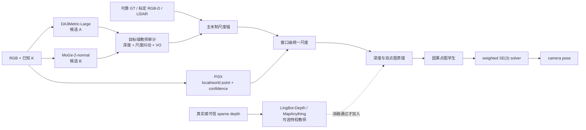
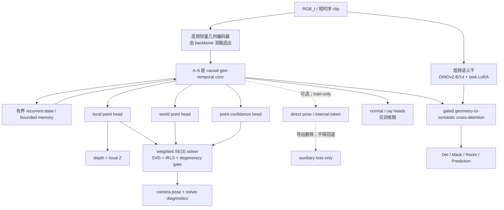

# DINO-GeoSemMap v-next.2 深度与几何多教师蒸馏方案

> [!WARNING] 2026-08-10 口径更正（优先级高于本文其余历史表述）
> 本文是历史汇总与交叉检索入口。**教师、学生和蒸馏/验收的权威版本分别是 [[01_教师模型选型与目标域审计]]、[[02_学生模型选型与端侧架构]]、[[03_蒸馏方法与训练验证方案]]；若本文与 01/02/03 冲突，一律以后者为准。**
>
> 当前正式边界是不接入 LOGOPlanner/NavDP，也不以显式 pose head 或隐式 `pose_token/state` 作为部署位姿来源。唯一正式链路为：
>
> `RGB (+ K) → local_points + world_points + point_confidence → weighted SE(3) solver → camera pose`
>
> `depth_metric` 由 `local_points[..., 2]` 得到。direct pose、独立 learned-pose-covariance head 和内部 token 只允许作为 **train-only、默认关闭、可整支删除** 的辅助项；它们不得进入正式接口、不得充当求解器失败时的后门回退，也不得用于主表位姿。正式 covariance 由 solver 残差和几何条件派生。

> 关联文档：[[08_DINO-GeoSemMap_训练计划]]、[[20_DINO-GeoSemMap_四头Loss设置与下一阶段优化]]、[[21_DINO-GeoSemMap_v-next_总架构愿景]]、[[01_VGGT谱系与在线位姿推理选型]]
>
> 本文回答三个问题：**教师模型选什么、学生模型选什么、采用什么蒸馏方法**。本文是 P0 选型与实验设计，不是最终超参数定稿。
>
> 项目内历史证据：`C:\Users\11440\Desktop\基于LOGOPlanner架构的前馈式视觉里程计实验.pdf`。其中的数值只作为点图配准失败模式与历史基线的参考，不再定义当前系统接口，也不作为公开 benchmark 结论。
>
> 当前固定 P0 训练架构图：[[DINO-GeoSemMap_v-next.2_深度与Pi3位姿多教师蒸馏架构.drawio]]（文件名为保持旧链接未改；图内已直接选定 DA3Metric-Large + Pi3X + DINOv2/Geo-Adapter + 4-layer causal core + frozen weighted SE(3) solver，接口仍以 01/02/03 为准）。
>
> **三问题拆分后的维护入口**：
> - 教师模型选什么：[[01_教师模型选型与目标域审计]]；
> - 学生模型选什么：[[02_学生模型选型与端侧架构]]；
> - 采用什么蒸馏方法：[[03_蒸馏方法与训练验证方案]]。
>
> 本文已同步更正关键摘要、接口、架构、损失、训练、消融和验收；细节仍以三篇权威拆分文档为准。

---

## 0. 结论先行

### 0.1 修订后的推荐组合：先审计，后冻结

**LingBot-Depth 不是必选项，MoGe-2 也不是未经验证的默认答案。** 本项目应先把教师按职责拆开，再根据目标域审计冻结模型。教师角色的优先级如下：

| 职责         | 当前候选                                                               | 主要提供的监督                                                        | 本文结论                                        |
| ---------- | ------------------------------------------------------------------ | -------------------------------------------------------------- | ------------------------------------------- |
| 最高优先级米制真值  | Habitat 渲染 GT、标定后的 RGB-D/LiDAR、可靠 GT pose                          | metric depth、有效区、Pi3 平移尺度复核                                    | **有可靠真值时优先于任何学习模型**                         |
| 单帧米制/尺度教师  | **DA3Metric-Large**、**MoGe-2-normal**；复核候选为 Metric3D v2、UniDepthV2 | metric depth、confidence；MoGe-2 另给 point/normal/mask            | **必须经同一目标域审计后只选一个主尺度教师**                    |
| 相对形状/边界教师  | MoGe-2-normal、Depth Pro、Depth Anything 系列                          | depth gradient、normal、边界和局部形状                                  | 只能辅助形状，不得覆盖主尺度                              |
| 时序深度教师     | Metric Video Depth Anything-Small                                  | temporal-consistent depth                                      | 仅在其窗口尺度稳定性通过后加入，默认不做尺度锚                     |
| RGB-D 特权教师 | LingBot-Depth v0.5、MapAnything-Apache                              | completion、RGB-D 融合 feature、缺失区几何                              | **仅在有真实/可信 sparse depth，或 feature 消融通过时加入** |
| 多视点图与几何教师  | **Pi3X**                                                           | local/world point map、point confidence、由三者派生的跨视一致性 | **研究阶段 `pointmap_vo` 主教师；不读取 direct pose/ray/token**               |
| 在线因果点图教师  | CUT3R                                                              | 因果状态更新、世界系 point map、在线 depth/geometry                         | 进入流式学生阶段后再考虑；pose 仍只作审计                    |

对当前“已知标定 $K$、仿真有 GT、真机可采 RGB-D”的设置，建议首轮这样做：

1. 可靠 GT/传感器有效像素直接作为最高优先级米制监督；
2. 在无 GT 的 RGB 上公平审计 **DA3Metric-Large** 与 **MoGe-2-normal**，暂定前者为纯 metric-depth 第一候选、后者为几何丰富第一候选；
3. 只允许审计胜出的一个模型定义 Pi3X 的窗口米制尺度，另一个若保留，只监督 scale-invariant shape/normal；
4. LingBot-Depth 默认不进入最小包；只有真实/可信 sparse depth 条件成立，或其 feature/completion 确实改善最终深度、点图或配准位姿指标时才加入；
5. Pi3X 严格只提供 `local_points/world_points/confidence`；跨视几何、方向与 camera pose 审计均由这三项经统一 solver 派生。



这里不存在脱离目标域的“全局最优深度教师”。本文给出的默认只是**首轮候选顺序**，最终选择由 §6 的教师审计和由该教师训练出的学生 VO 表现决定。

### 0.2 学生模型结论

分成三个可独立判闸的阶段，不在第一轮同时更换所有变量：

1. **P0a 单帧局部几何学生**：当前 DINOv2-B/14 + 私有 Geo-Adapter/Geo-LoRA + DPT-Lite，验证 metric local point、`depth=local Z`、normal 与可选 feature KD；该阶段不验收位姿。
2. **P0b 双点图学生**：在 P0a 上增加轻量因果/成对时序模块，正式输出 `local_points`、`world_points` 和逐点 `confidence`；使用可微 weighted SE(3) solver 形成训练与部署闭环。
3. **目标学生**：DINOv2-B/14 语义主干 + 经消融选出的轻量几何编码器（现有 Geo-Adapter 或 LingBot-Vision-S/16 等候选）+ 4–6 层因果几何时序核心 + 有界循环状态 + local/world/confidence heads。

正式输出契约是：**米制 `local_points` + 同一窗口世界系的 `world_points` + 校准后的逐点 `confidence`**。`depth_metric` 是 local point 的 Z 分量；相机位姿及其 covariance 由三者经鲁棒加权刚体配准和 solver 诊断得到。direct pose、独立 learned covariance head 和内部 token 均不是部署输出，只能作为可删除的训练期辅助。

目标学生保留现有语义能力，同时让几何能力进入独立可训练路径。不要继续期待完全冻结的 DINOv2 patch 特征仅靠一个新深度头学出多视几何与 VO。

### 0.3 蒸馏方法结论

采用分阶段、点图闭环式多教师蒸馏：

1. **局部米制几何**：metric depth/local point、relative shape、gradient、normal 与 ray consistency；
2. **共同世界系点图**：Pi3X/GT 的 world point、窗口首帧 gauge、刚性与跨视重投影；
3. **点图位姿闭环**：把学生 `local/world/confidence` 输入可微 weighted SE(3) solver，以其输出计算 pose、multi-span、cycle 和窗口拼接损失；
4. **置信度学习**：用点残差/inlier 标签、异方差 NLL、覆盖率正则与退化条件监督，禁止全低置信度塌缩；
5. **可靠性门控**：valid/dynamic/occlusion mask、教师分歧、尺度稳定性与 SVD 条件数共同决定权重；
6. **因果蒸馏**：只用截至当前帧的 teacher prefix/window，把离线多视能力蒸馏给有界状态学生。

明确不采用：两个教师深度直接平均、未经尺度对齐的 Pi3 点图、逐帧独立 scale fit、用 Sim(3) 掩盖米制误差、未经 gauge 对齐的 world point、把 Pi3 绝对 `c2w` 当学生正式输出目标，以及用 direct pose/token 绕过点图求解器。

### 0.4 历史视觉里程计实验留下的约束

历史实验仍有三条可复用证据，但不再规定系统消费方：

1. `local_points → world_points` 的普通 SVD 在低视差、纯旋转、长走廊和房间入口会退化，因此正式实现必须使用 point confidence、动态/遮挡 mask 与条件数门控，并在 T11 审计后冻结是否启用鲁棒 IRLS；当前首选候选启用 IRLS。
2. Pi3 confidence 加权后更稳，说明逐点可靠性必须进入求解器；帧级 pose 可靠性应从配准残差、有效点数和 SVD/Hessian 条件数派生，而不是由独立 pose head 决定。
3. 历史 State Token MLP 的收益只说明时序表征可能有辅助价值，不能据此让 token 成为部署位姿路径。它若保留，只能作为 train-only 可删除分支，并必须证明会改善正式点图与求解器结果。

因此当前冻结判断为：**Pi3X 是多视点图与几何教师；学生部署时只输出 local/world point 与 confidence，位姿只由 weighted SE(3) solver 产生，深度严格等于 local Z。**

---

## 1. 当前深度头为什么不足以证明几何能力

当前深度方案是：

```text
DINOv2 ViT-B/14（冻结）
  → Multi-scale Adapter（训练后冻结）
  → DPT
  → metric depth + confidence
```

当前 loss 为 masked L1 + gradient + SILog + uncertainty NLL，属于输出回归监督，没有 point map、surface normal、relative pose、跨视一致性或中间几何特征监督。[[20_DINO-GeoSemMap_四头Loss设置与下一阶段优化]] 也明确记录该深度配方尚未专门调过。

旧实验记录中的 AbsRel 0.0564、δ1 0.9659、RMSE 0.1870 本身不差，但训练规模约 2.9 万帧，L0 评估仅约 96 帧且基本同域。它能证明 DPT 头可以拟合当前数据，不能证明：

- 跨相机、跨焦距和真机泛化；
- 透明、镜面、低纹理区域的稳定性；
- surface normal、point map 和局部平面结构；
- 跨帧一致性与相对位姿能力；
- frozen backbone 已形成可迁移的几何表征。

因此需要分别验证两个假设：

- **H1：输出头不足**——更好的伪标签和结构 loss 即可改善；
- **H2：特征不足**——必须让几何知识进入可训练的 Geo-Adapter/Geo-Trunk。

后续消融必须能区分 H1 与 H2，不能一次性同时换教师、主干、头和数据。

---

## 2. 教师模型选型

### 2.1 选择标准

教师不是按单一 benchmark 排名，而是按以下标准选择：

1. **目标域米制准确性**：无 median scaling 的 AbsRel/RMSE、每场景 scale bias，而不是论文汇总分数；
2. **对 Pi3 点图配准尺度的影响**：重叠窗口 `std(log s*)`、raw solver metric RPE-t/ATE 和窗口边界平移跳变；
3. **输入条件匹配**：RGB-only、是否需要 $K$/FOV、还是依赖 sparse/raw depth；
4. **几何信号完整性**：point map、normal、boundary、valid mask、intrinsics、confidence；
5. **时序属性**：是否稳定跨帧，而不是逐帧预测闪烁；
6. **置信度可校准性**：confidence 是绝对误差估计、单图内相对排序，还是根本没有输出；
7. **学生可吸收性**：输出 KD 是否已足够，是否真的需要 feature/token 对齐；
8. **权重许可与复现状态**：代码许可不能自动代表 checkpoint 许可；新模型必须先验证实际可下载与可复现；
9. **离线成本**：吞吐、显存、缓存量与伪标签生成周期。

教师必须按以下四类角色登记，禁止混用：

- `primary_metric`：**唯一允许定义米制尺度**；
- `relative_shape`：只监督 scale-invariant depth、gradient、normal、edge；
- `feature_privileged`：只做表示蒸馏，不覆盖输出尺度；
- `pointmap_vo`：只登记 Pi3X local/world point 与 confidence；camera pose 和跨视关系由统一 solver 派生，多视米制尺度由 `primary_metric` 校准。

### 2.2 核心候选对比

| 模型 | 输入 | 关键输出/特征 | 优点 | 主要限制 | 许可与可用性 | 选型 |
|---|---|---|---|---|---|---|
| [DA3Metric-Large](https://huggingface.co/depth-anything/DA3METRIC-LARGE) | RGB + focal/$K$ | monocular metric depth、置信/天空信息 | 0.35B；已知标定 $K$ 与当前项目匹配；与 Pi3 pose 职责重叠较少 | 不直接给 normal；米制转换依赖 focal 与预处理严格一致；工作较新 | [Depth Anything 3 官方代码](https://github.com/ByteDance-Seed/depth-anything-3)，该 metric 权重 Apache-2.0 | **已知 $K$ 时的纯尺度第一候选** |
| [MoGe-2-normal](https://arxiv.org/abs/2507.02546) | RGB，可选已知 FOV | metric point/depth、normal、mask、intrinsics/FOV | 一次给出最完整的单图局部几何；ViT-S/B/L 可选；适合 point/normal KD | 单帧、无 pose/temporal；单目尺度仍需目标域校准；confidence 需另做经验校准 | [官方代码](https://github.com/microsoft/MoGe)，MIT | **几何丰富第一候选，可竞争主尺度** |
| [UniDepthV2](https://arxiv.org/abs/2502.20110) | RGB，可选 $K$ | metric depth、camera、point、uncertainty | 未知/变化相机和跨域能力强；可自估内参 | 置信度主要是单图内相对可靠性，OOD 需校准；研究非商用 | [官方代码](https://github.com/lpiccinelli-eth/UniDepth)，CC BY-NC 4.0 | **未知 $K$/研究场景的度量锚候选** |
| [Metric3D v2](https://arxiv.org/abs/2404.15506) | RGB + 准确 $K$/Canonical Camera | metric depth、normal、confidence | 成熟的已知 $K$ 度量/法向基线；与现有 Canonical Camera 流程一致 | $K$ 错会同时污染深度尺度和点图；较重 | [官方代码](https://github.com/YvanYin/Metric3D)，代码 BSD-2；量产前核验权重条款 | **独立尺度/法向复核教师** |
| [MetricAnything PointMap](https://github.com/metric-anything/metric-anything) | RGB | metric point/depth、mask、$K$ | 326M、Apache-2.0；特权深度到 RGB-only 的蒸馏范式与本任务吻合 | 2026 年新模型；原始 prompt teacher checkpoint 尚未完整公开 | 官方 PointMap student 可用 | **观察名单，进入小规模 bake-off** |
| [Metric Video Depth Anything](https://arxiv.org/abs/2501.12375) | RGB video | temporal-consistent metric depth | 长视频稳定，Small 轻量且 Apache-2.0 | 无 point/normal/pose；实验 streaming 模式明显降精度；metric 训练域有限 | [官方代码](https://github.com/DepthAnything/Video-Depth-Anything)；Small Apache，B/L 非商用 | **时序形状教师，默认不定义尺度** |
| [Depth Pro](https://arxiv.org/abs/2410.02073) | RGB | sharp metric depth、focal | 高分辨率边界、细结构强，不要求给定内参 | 约 0.3 s/2.25MP；无 point/normal/pose；Apple 自定义许可需审查 | [官方代码](https://github.com/apple/ml-depth-pro) | 边界/细结构辅助教师 |
| [LingBot-Depth](https://arxiv.org/abs/2601.17895) | RGB + 不完整/伪深度 + $K$ | metric completion、camera-space point、RGB-D fused feature | 对传感器孔洞、透明/反光/低纹理和 sparse depth 有针对性 | 核心是 RGB-D completion；没有 pose/temporal；公开 checkpoint 不能直接视为最佳 RGB-only 单目教师 | [v0.5 官方仓库](https://github.com/robbyant/lingbot-depth)，Apache-2.0 | **条件式特权教师，可完全删除** |
| [MapAnything](https://arxiv.org/abs/2509.13414) | 单/多图，可选 $K$/pose/depth/partial geometry | metric depth/point/ray/camera/scale | 可桥接尺度、相机与部分 RGB-D；任务覆盖广 | 约 1B，成本高；与 Pi3 多视职责高度重叠，不宜并列等权 | [官方代码](https://github.com/facebookresearch/map-anything)；有 Apache 与非商用两类权重 | 小规模尺度/点图审计或 RGB-D 上界 |
| [LingBot-Vision](https://arxiv.org/abs/2607.05247) | RGB | 边界、形状和区域 patch token | 纯 RGB；适合作 feature KD 或学生初始化 | 只有 backbone；patch-16 与当前 patch-14 网格不同 | [官方仓库](https://github.com/robbyant/lingbot-vision)，Apache-2.0 | 可选特征教师/学生候选 |
| [Pi3 / Pi3X](https://arxiv.org/abs/2507.13347) | 无序多图/视频；Pi3X 可注入 K/depth | 本项目只读 local/world（官方常称 global）point map 与 confidence | 无固定参考帧；同像素双点图适合统一 solver 求 pose | 原始 Pi3 scale-invariant；Pi3X 仅近似 metric；非因果、约 1B | [Pi3X 官方仓库](https://github.com/yyfz/Pi3)：代码 BSD-3，权重 CC BY-NC 4.0 | **主 `pointmap_vo` 教师，限研究** |

上表不能直接变成“把所有模型同时跑一遍并平均”。DA3 any-view/Nested、MapAnything、VGGT 与 Pi3 在多视相机/几何职责上高度重叠；当前主线选择 Pi3X 做 local/world point 与 confidence 教师，因此它们最多作为小规模审计或替换对照。主深度教师优先选择职责更纯、尺度更易审计的 DA3Metric-Large、MoGe-2-normal、UniDepthV2 或 Metric3D v2。

### 2.3 条件式深度教师决策

#### 2.3.1 决策树

```text
是否有可靠的目标域米制深度或米制位姿 GT？
├─ 有
│  ├─ dense GT / 标定 RGB-D/LiDAR 有效像素
│  │  ├─ GT/sensor 直接做 primary_metric
│  │  └─ learned teacher 只补无效区、边界、normal 或扩大无标签数据
│  └─ 只有 sparse/noisy depth
│     ├─ 孔洞、玻璃、反光、低纹理问题突出
│     │  └─ 审计 LingBot-Depth 或 MapAnything completion
│     └─ 否
│        └─ sparse GT + RGB-only metric teacher 即可
└─ 没有
   ├─ K/focal 可靠
   │  └─ 首轮公平比较 DA3Metric-Large、MoGe-2-normal、Metric3D v2
   ├─ K/focal 不可靠或相机变化很大
   │  └─ 优先审计 UniDepthV2、MoGe-2，并把 intrinsics confidence 纳入门控
   └─ 所有候选在目标域的绝对尺度均不可靠
      └─ metric_valid=false；只蒸馏去尺度 local/world shape/normal，并只监督
         点图 solver 的 rotation、translation direction、baseline ratio 和 cycle

完成上面的尺度选择后，才判断是否需要额外 feature teacher：
├─ LingBot completion/feature 对深度、点图或 raw solver VO 有稳定显著增益 → 保留
├─ 仅边界/形状有问题 → 比较 MoGe/Depth Pro/LingBot-Vision feature 或结构 loss
└─ output KD 已足够 → 不加入任何 feature teacher
```

#### 2.3.2 当前项目的首轮排序

当前项目已知 $K$，且仿真可获得无噪声 GT depth/pose。因此建议：

1. **GT/标定传感器优先**：GT 有效区直接监督，不经过任何 learned teacher；
2. **DA3Metric-Large 与 MoGe-2-normal 同场 A/B**：前者回答“纯米制尺度是否更稳”，后者回答“point/normal/mask 的额外几何是否更值钱”；
3. **Metric3D v2 作为独立复核**：若前两者尺度结论冲突，用相同 $K$ 再检验；
4. **UniDepthV2 只在研究许可可接受、或需覆盖未知相机时上场**；
5. **MetricAnything PointMap 进入 1k–2k clip 小审计，不立即批量生成标签**；
6. **最终只选一个 `primary_metric`**。第二名若保留，先按每帧中位数归一后只贡献 relative shape/normal，不得再给一套独立米制 target；
7. **用各候选训练出的学生 VO 决胜**：即使教师自身 AbsRel 更低，只要其窗口尺度抖动使 Pi3 translation/RPE 变差，也不能入选。

DA3Metric-Large 的官方米制换算依赖 focal（模型卡给出的形式为 `metric_depth = focal_px × network_output / 300`），这里的 `focal_px` 必须对应**网络实际输入坐标系**，即在 resize/crop/pad 后同步更新的 $K_{network}$；误用原图 focal 会把预处理比例直接写进深度和 Pi3 平移尺度。MoGe-2 若注入已知 FOV，也必须使用同一个 $K_{network}$ 约定。教师审计前先用合成平面/已知深度单元测试这条链路。

若第一轮资源只够跑一个模型：已知可靠 $K$ 且主要缺口是米制尺度时先跑 DA3Metric-Large；若还需要 point map、normal、valid mask 与边界结构时先跑 MoGe-2-normal。这个条件式结论比宣称某个模型在所有场景都“最好”更可靠。

#### 2.3.3 LingBot-Depth 的条件式角色

LingBot-Depth 的公开模型以 RGB 和不完整深度共同作为输入，目标是补全、精修传感器深度。其论文中的单目实验是移除 depth embedding 与 completion decoder，再用 encoder 初始化 MoGe 路线，并不是证明公开 completion head 可以在缺少 depth 输入时直接提供最可靠的单目 metric depth。

官方 LingBot-VLA 的实际做法也不是直接复制一张 LingBot 深度图，而是：

```text
RGB
  → frozen MoGe-2
  → pseudo depth
  → frozen LingBot-Depth.infer_feat
  → RGB-D fused geometry tokens
  → query/feature alignment
```

官方配置采用 8 个 task query，将教师侧 256 个、1024 维空间 token 注入学生；该实现是“特征蒸馏有效”的直接先例，而不是“最终深度图直接蒸馏”的证据。参考 [LingBot-VLA 2.0 Training Config](https://github.com/Robbyant/lingbot-vla-v2/blob/main/configs/vla/Training_Config.md) 和 [LingBot-VLA 教师目标生成代码](https://github.com/Robbyant/lingbot-vla/blob/main/lingbotvla/models/vla/vision_models/module_utils.py)。

因此只在下列条件下保留 LingBot-Depth：

- 有真实 raw/sparse depth、SfM 点或可信传感器孔洞模式；
- 目标环境的玻璃、反光、低纹理和缺失深度是主要失败源；
- 只在训练期使用，最终学生仍为 RGB-only；
- completion 或 fused-feature KD 在相同预算下确实改善深度、点图质量或 weighted-SE(3) 的 metric RPE/ATE。

以下情况可完全删除 LingBot-Depth：

- 训练数据只有 RGB，且只能用另一个单目模型生成其全部伪 depth 输入；
- Habitat 已有无噪声米制 GT，或标定传感器有效区已足够；
- 预算只允许一个深度教师；
- 目标主要是 RGB-only metric depth/point map、时序一致性或 pose；
- feature KD 相对 output-only 没有超过随机波动和额外成本。

若只有 RGB，仍可把经审计的主深度输出喂给 LingBot-Depth，再蒸馏其 fused token，但这是一条**待证明的特权 feature 路线**，不能形成“单目教师 A 生成伪深度 → LingBot 再加工 → 自动更真”的循环论证。

### 2.4 Pi3X 的正确职责

本文把当前实验中的 Pi3-derived decoder、原始 $\pi^3$ 论文模型与工程候选 Pi3X 统称为“Pi3 系列”。正式伪标签优先审计 Pi3X，但论文级能力证据仍回溯原始 $\pi^3$。本项目不读取教师 direct pose；所有坐标、尺度和位姿审计均由登记的 local/world point 与 confidence 经统一 solver 派生。

Pi3X 不是第二个普通单目深度模型，而是本项目的**多视点图与几何主教师**。优先蒸馏顺序为：

1. 每视图相机系 `local_points` 与同一窗口坐标系 `world_points`；
2. point confidence 与教师在 permutation/subset 下的稳定性；valid 由有限值/阈值派生，static/occlusion mask 来自外部数据或预处理；
3. 从 local point 派生的 `z_depth = local_points[...,2]`、`range = ||local_points||₂`、surface normal、gradient 与局部平面结构；
4. 统一 clip 尺度与首帧 gauge 下的跨视重投影、刚性和 3D consistency；
5. 由点图加权配准得到的相对/累计位姿、多跨度与 cycle；
6. 由点图 solver 派生的 relative pose 只用于监督/审计注册闭环；不缓存 Pi3X direct pose、ray 或内部 token/feature。

正式位姿只有一条路径：

| 路径 | 正式输入/输出 | 用途 | 部署状态 |
|---|---|---|---|
| 点图位姿 | `local_points + world_points + point_confidence → weighted SE(3)` | 相机 pose、RPE/ATE、窗口拼接与故障检测 | **唯一保留** |
| direct pose head | 时序特征 → `ΔT` | 可选训练辅助或诊断 | 默认关闭；导出删除 |
| internal token/probe | 隐状态 → pose probe/relation | 可选表示消融 | 默认关闭；不导出 |

direct pose 或 token 即使在某次消融中有效，也只能通过改善点图/置信度与正式 solver 指标来证明价值；不得成为求解器退化时的静默 fallback。

原始 Pi3 的深度为 scene-level scale-invariant，camera pose 也存在全局 gauge ambiguity。Pi3X 虽增加 approximate metric scale，仍不应取代真实 metric GT、标定传感器或经目标域审计胜出的 `primary_metric`。

### 2.5 推荐教师包

#### 包 A：最小默认包（当前主线）

```text
Selected Primary Metric Teacher
  ├─ 已知 K：DA3Metric-Large vs MoGe-2-normal 审计胜者
  └─ 未知/变化 K：UniDepthV2 vs MoGe-2-normal 审计胜者
+ Pi3X（local/world point + confidence + 多视几何）
```

这是本文主推荐。**LingBot-Depth 不在最小默认包中。** 若 GT/标定传感器覆盖充分，`Selected Primary` 可直接是 GT/sensor，而不是学习模型。

#### 包 B：几何细节增强

```text
Selected Primary Metric Teacher（唯一尺度）
+ MoGe-2-normal / Depth Pro（只提供 point/normal/edge/relative shape）
+ Pi3X（point map + confidence + multiview）
```

第二深度教师必须去尺度化后再参与辅助 loss，避免两套米制伪标签互相拉扯。

#### 包 C：存在真实稀疏深度或传感器孔洞

```text
GT / calibrated sensor valid pixels（最高优先级）
+ LingBot-Depth v0.5（真实 sparse depth 输入）
+ 可选 MapAnything-Apache completion 上界
+ Pi3X（RGB + K；可选注入完成深度）
```

必须把“真实 sparse depth 条件”和“单目伪深度条件”分开消融；传感器有效像素不能被 completion 模型覆盖。

#### 包 D：视频时序增强

```text
Selected Primary Metric Teacher（只在 keyframe 定义尺度）
+ Metric Video Depth Anything-Small（temporal/relative depth）
+ Pi3X（point map + confidence + multiview）
```

视频教师用于减少 depth flicker。只有其窗口尺度 bias/jitter 通过审计后，才允许辅助绝对深度；否则只计算每窗口归一化后的 temporal/gradient loss。

#### 包 E：许可敏感的 RGB-only 路线

```text
DA3Metric-Large（Apache-2.0）或 MoGe-2-normal（MIT）
+ 可选 LingBot-Vision / LingBot-Depth（Apache-2.0，仍按输入条件决定）
+ MapAnything-Apache（仅审计）
+ 获得明确授权的 multiview point teacher 或自训几何教师
```

Pi3X、CUT3R、DUSt3R/MASt3R 的公开权重包含非商业限制。任何从这些权重蒸馏并计划商业发布的学生，都应先取得作者书面许可并进行法律确认。

---

## 3. 学生模型选型

### 3.1 必须继承的系统约束

学生应满足 v-next.2 已确定的边界：

- 推理主输入为逐帧 RGB；已知 K 优先作为输入/预处理，未知 K 模式后置验证；
- 因果在线，增量计算；
- 记忆有界，延迟和显存不随轨迹线性增长；
- 正式几何头每帧输出同像素对应的 `local_points`、`world_points`、`point_confidence` 与 valid mask；
- `local_points` 为当前相机坐标系，`world_points` 为当前 segment/window 的共同世界系；世界系首帧固定为单位 gauge；
- `depth_metric = local_points[...,2]`，不得另设一个会与 local Z 分叉的部署深度头；
- 相机位姿只由 local/world/confidence 的 weighted SE(3) 刚体求解得到；
- 禁止逐帧尺度拟合；窗口间只允许用重叠点/位姿做一个刚体 SE(3) 拼接，不得再拟合 Sim(3) scale；
- 求解退化时输出 `weak/lost/invalid` 与诊断量，不能调用 direct pose/token 伪造有效位姿；
- 网络只承担局部几何与 VO 前端，长程一致性可交给独立 pose graph/loop closure，但主表必须同时报告 raw solver pose；
- 可兼容已有语义输出，但本方案不假设或依赖任何 Planner/NavDP 消费接口；
- geometry → semantic 先采用单向、门控注入，避免破坏成熟语义能力。

### 3.2 双点图与求解器输出契约

学生的正式网络输出只有点图与逐点置信度；pose 与求解器诊断是确定性后处理结果：

```yaml
geometry_output:
  frame_id: int
  timestamp: float
  segment_id: int

  geometry:                      # 学生正式输出
    local_points: HxWx3          # 当前相机坐标系，单位 m
    world_points: HxWx3          # 当前 segment/window 世界系，单位 m
    point_confidence: HxW        # 校准后的 inlier/reliability 概率
    valid_mask: HxW
    K_used: [3, 3]
    depth_metric: HxW            # 严格等于 local_points[..., 2]

  registration:                  # weighted SE(3) solver 派生
    T_frontend_c2w: [4, 4]
    delta_T_prev_cur: [4, 4]
    residual_median: float
    residual_p90: float
    inlier_ratio: float
    effective_point_count: float
    condition_number: float
    degeneracy: none | low_parallax | collinear | planar_weak | insufficient
    tracking_status: ok | weak | lost
    metric_valid: bool
```

以下字段只允许存在于训练图或调试日志，正式导出必须删除：`direct_delta_T`、`direct_pose_covariance`、`pose_token/state`、teacher feature projector。它们不得被下游读取，也不得在 solver 返回 `weak/lost` 时接管位姿。

统一坐标约定，禁止再使用无方向下标的 `T`：

- `P^L_{t,i}`：时刻 `t` 第 `i` 个有效像素对应的相机系 local point；`P^W_{t,i}`：同一观测在 segment 世界系中的 world point；
- `T^front_{w←c,t}` / `T_frontend_c2w[t]`：把时刻 `t` 的相机坐标点变换到当前 segment 世界系；segment 首帧固定为单位阵；
- `ΔT_{c_i←c_j} = inv(T^front_{w←c,i}) · T^front_{w←c,j}`，并满足 `T^front_{w←c,j}=T^front_{w←c,i}·ΔT_{c_i←c_j}`；
- `T_global_c2w` 只表示经过 pose graph/loop closure 的后端结果；不得无标记覆盖 `T_frontend_c2w`。

正式配准固定为带鲁棒核的加权刚体 SE(3)：

$$
\hat T^front_{w\leftarrow c,t}
=\arg\min_{R\in SO(3),\,\mathbf t}
\sum_{i\in\Omega_t}\bar w_{t,i}\,
\rho\!\left(\left\|RP^L_{t,i}+\mathbf t-P^W_{t,i}\right\|_2\right).
$$

其中 `\bar w` 由学生 confidence、valid/static/occlusion mask 与 IRLS 鲁棒权重共同得到。实现采用 weighted Kabsch/SVD，并在反射时修正 `det(R)=+1`。有效点不足、空间分布退化、SVD 条件数过差或残差超门限时必须返回低置信/无效。重叠窗口只用一个 SE(3) 对齐其共同帧；tracking lost 后新建 `segment_id` 并把首帧 gauge 重置为 `I`。

### 3.3 P0a 单帧验证型学生：最小改造

目的：只回答“深度/局部几何教师信号有没有价值”，而不是一次完成最终架构。该阶段不训练 pose head，也不能以 ATE/RPE 宣称 VO 已通过。

```text
DINOv2-B/14
  ├─ 原语义路径：保持冻结
  └─ 私有 Geo-Adapter / 后 1/3 blocks 的 Geo-LoRA
       → DPT-Lite
       ├─ metric local point / Z-depth
       ├─ point confidence
       └─ normal head（仅训练期）
```

推荐设置：

- 先保留当前 896×504 主训练分辨率与 Canonical Camera Transform；
- 语义主干参数不被几何 loss 直接更新；
- Geo-Adapter/Geo-LoRA、DPT-Lite 和训练期 normal head 可训练；
- 已知 K 时可把 local point 参数化为“预测 Z + K 射线反投影”，但接口仍输出完整 `local_points`：

$$
P^L_s(u,v)=D_s(u,v)K^{-1}[u,v,1]^T,
\qquad D_s=P^L_s[...,2]
$$

- 若增加 local XY residual head，必须受 ray consistency 约束；P0a 不产生正式 world point 或 pose。

#### 可选 feature teacher 对齐头

feature KD 不是 P0a 的必备组件。只有 output-only 基线稳定后，才为通过审计的 feature teacher 增加 projector。以 224×224 同视图 crop 的 LingBot 路线为例：

- DINOv2-B/14 patch token：`[B, 256, 768]`；
- LingBot-Depth ViT-L/14 feature：`[B, 256, 1024]`。

建议使用：

```text
LayerNorm
  → Linear/MLP(768 → 1024)
  → normalized Smooth-L1 + cosine + relation loss
```

若 feature 教师换成 MoGe-2、LingBot-Vision 或其他已登记 `feature_privileged` 模型，projector 输出维度随教师设置，缓存必须记录 `teacher_id/layer/grid/preprocess`。Pi3X 不进入 feature 路线，只能从其 local/world points 派生几何 relation。首轮 feature KD 只在相同 crop/K 下进行；若没有优于 output-only，则删除 projector 和对应教师。

### 3.4 P0b 与目标学生：轻量因果双点图专家

推荐结构：



选型理由：

- **语义主干保留 DINOv2-B/14**：减少现有多头回归风险；
- **几何编码器与教师模型独立选择**：首轮比较现有 DINOv2-B/14 + Geo-Adapter、LingBot-Vision-S/16 与轻量 metric-depth backbone；LingBot-Vision 只是边界预训练较强的候选，不因使用或不使用 LingBot-Depth 而自动入选；
- **时序核心采用 CUT3R-style recurrent state，而不是无界 KV cache**：满足 O(1) 状态和长序列部署要求；
- **local/world/confidence 是不可删的正式三头**：它们共同决定 camera pose；其中 local Z 就是唯一部署深度；
- **位姿可靠性来自求解器**：由残差、inlier ratio、有效点数与 SVD/Hessian 条件数综合得到；独立 pose covariance 不是正式信号；
- **direct pose/token 默认不存在**：若为训练辅助加入，必须能在导出删除后仍提升正式点图和 solver 指标；
- **几何→语义先单向注入**：先验证空间一致性是否改善 detection/mask，而不允许语义路径反向拖慢高频几何回路；
- **normal/ray/projector 可训练期删除**：它们只为几何蒸馏提供额外约束，不属于正式接口。

注意：纯单帧学生只能学习局部形状先验，无法稳定定义跨帧共同 world frame。要输出可配准的 `world_points` 并获得 pose，因果时序核心不是可选项。

P0b 可先复用 DINOv2-B/14 + Geo-Adapter，只新增 2–4 层轻量 temporal/cross-view block、world-point head、confidence head 与可微 solver；无需等完整双主干重构后才验证点图位姿。目标版本只有在 backbone 消融通过后，才替换为对应轻量几何干与 4–6 层有界因果核心。

### 3.5 学生备选

| 候选 | 适用场景 | 优点 | 缺点 | 结论 |
|---|---|---|---|---|
| 当前 DINOv2-B/14 + Geo-Adapter | 快速验证 | 改动最小、可归因 | 单帧能力上限明显 | P0a 首选 |
| LingBot-Vision-B/16 + DPT | 单帧 depth/normal | 空间边界特征强、Apache-2.0 | 需重训现有 patch-14 适配器和头 | 单干替换消融 |
| LingBot-Vision-S/16 + causal core | 端侧流式几何 | 轻量、边界预训练、可加有界状态 | 需新建几何数据与训练线 | 目标几何干候选，需与现有 Geo-Adapter A/B |
| CUT3R 缩小版 | 追求完整在线 3D | 结构与任务天然匹配 | 蒸馏/训练复杂，公开权重非商用 | 结构参考，不直接照搬 |
| [DepthART-S](https://arxiv.org/abs/2607.17099) | 只需端侧单帧 metric depth | 新的 tiny depth 强基线，内参条件化 | 不能替代多视几何/pose 学生；工作较新 | 监控项/深度基线 |

---

## 4. 蒸馏方法选型

### 4.1 总损失

推荐总目标以“点图可配准”为中心：

$$
\begin{aligned}
\mathcal{L}_{total} ={}&
\mathcal{L}_{depth}
+ \lambda_l\mathcal{L}_{local}
+ \lambda_w\mathcal{L}_{world}
+ \lambda_r\mathcal{L}_{pose\text{-}from\text{-}points} \\
&+ \lambda_g\mathcal{L}_{geometry}
+ \lambda_c\mathcal{L}_{cycle\text{-}stitch}
+ \lambda_q\mathcal{L}_{point\text{-}confidence}
+ \lambda_f\mathcal{L}_{feature}
+ \lambda_o\mathcal{L}_{optional\text{-}aux}.
\end{aligned}
$$

其中：

- `L_depth`：约束 `D_s=P^L_s[...,2]` 的 GT/传感器/唯一主教师米制深度，以及去尺度辅助 shape/gradient/normal/boundary；
- `L_local`：学生 local point 对齐统一尺度的教师/GT 相机系点图，并满足 K-ray 与 local-Z 一致性；
- `L_world`：学生 world point 在首帧固定 gauge、同一 clip 尺度下对齐教师/GT，并约束静态刚性；
- `L_pose-from-points`：只把学生 local/world/confidence 输入可微 weighted SE(3) solver，用求得的 `T` 对齐 GT 或由 Pi3X 点图经同一 solver 派生的 relative pose；梯度必须回到双点图和 confidence；
- `L_geometry`：`depth↔local point↔registered pose↔world reprojection` 的闭环、ray/normal/rigidity 与跨视 point consistency；
- `L_cycle/stitch`：solver-derived pose 的多跨度 composition/cycle，以及相邻窗口只经一个 SE(3) 的重叠一致性；
- `L_point-confidence`：由配准残差/inlier target 学习的异方差 NLL、校准项和 coverage 正则，防止全低或少数点独占；
- `L_feature`：可选 feature teacher 的投影/关系蒸馏；默认权重为 0，只有独立消融通过才启用；
- `L_optional-aux`：direct pose head、internal token/probe 或来自已登记 feature teacher 的 feature KD；默认权重为 0，始终 train-only，必须可整支删除。Pi3X 不提供内部 feature。

核心优先级固定为：`depth/local → world/gauge → confidence/solver → pose-from-points/cycle → feature/optional aux`。P0a 只激活 `L_depth + L_local`，P0b 再依次打开 world、confidence、solver 与闭环；不得先训练 direct pose 再把点图当装饰输出。

共享主干时，每个 batch 记录 `depth/local`、`world`、`solver-pose` 与 `confidence` 在最后共享 block 上的梯度范数和余弦。默认先用 loss normalization/GradNorm；只有持续负冲突时再在共享主干使用 PCGrad/CAGrad，task-specific heads 不做投影。

### 4.2 米制深度输出蒸馏

GT、标定传感器或 `primary_metric` 分支建议使用：

$$
\mathcal{L}_{metric}
= \mathcal{L}_{log\text{-}Huber}
+ \alpha\mathcal{L}_{gradient}
+ \beta\mathcal{L}_{normal}
+ \gamma\mathcal{L}_{boundary}.
$$

说明：

- log-depth Huber 同时兼顾近处绝对误差和远处比例误差；
- gradient/boundary 防止伪标签蒸馏后过度平滑；
- normal cosine 传递表面朝向和平面结构；
- GT/标定传感器有效像素始终高于伪标签；伪标签只补无标签样本或传感器无效区；
- 对每个样本最高误差区域做截断/降权，可参考 Depth Anything V2 和 Distill Any Depth 的伪标签噪声处理思想。

若加入第二深度教师，其绝对尺度先被移除，只计算：

$$
\mathcal{L}_{shape}^{aux}
=\mathcal{L}_{SSI/ordinal}
+\alpha\mathcal{L}_{gradient}
+\beta\mathcal{L}_{normal}
+\gamma\mathcal{L}_{boundary}.
$$

这样由一个主教师定义“多少米”，辅助教师只回答“哪里近、哪里远、表面如何转折”。禁止两个单目教师各自给一套等权 meter loss，也禁止直接平均深度。

### 4.3 Pi3X 尺度与坐标对齐

在每个 clip/window 的可信重叠区域，用 GT、传感器深度或唯一 `primary_metric` 对 Pi3X 深度做**窗口级统一尺度**对齐。数值更稳定的实现是在 log 域求 weighted median：

$$
\log s^*=\operatorname{weighted\ median}_{(t,i)\in\Omega}
\left[\log D_{metric,t,i}-\log (Z_{Pi3,t,i}+\epsilon)\right].
$$

工程上可先 weighted median，再做一次 Huber IRLS。禁止逐帧独立缩放，否则会破坏同一窗口内 translation baseline 和多视点图的一致尺度。相同 `s*` 只显式作用于两套点图：

- `s* · local_points_Pi3`；
- `s* · world_points_Pi3`；
- `depth_Pi3 = (s* · local_points_Pi3)[...,2]`，camera translation 则由缩放后点图的冻结 SE(3) solver 自然产生。

`Ω` 只包含：

- 双方 valid；
- Pi3X 高 confidence；
- 非动态/非遮挡区域；
- 不处于深度传感器或伪标签明显失败区。

原始 Pi3 的世界原点、朝向和尺度都不能直接回归。训练标签把窗口首帧固定为单位阵，先用同一个 `s*` 固定 `local/world point` 的尺度，再只做刚性 SE(3) gauge 对齐；loss 不得额外自由拟合 Sim(3) scale。相邻重叠窗口的 `log s*` 只能由 GT/metric teacher/标定估计并 `stop-gradient`，禁止学生或每帧求解器自行寻找更好看的尺度。

学生必须正式输出 local/world point。已知 K 时，local point 可由预测 Z 沿 K-ray 参数化，或用 XY residual 修正；无论哪种实现，都必须满足 `D_s=P^L_s[...,2]` 和 ray consistency。world point 由时序核心直接预测并接受 gauge/rigidity/reprojection 监督，不能在部署时用 direct pose 把 local point 变换后冒充独立 world 输出。

#### 深度教师如何影响点图配准的平移尺度

同一个 $s^*$ 必须同时缩放 Pi3 local/world point；Pi3 depth 取缩放后 local Z，平移只由两套缩放后点图的冻结 solver 求得。若主深度教师在某域有约 $+8\%$ 的尺度偏差，由这些点图经 SE(3) 求得的米制平移通常也会继承近似 $+8\%$ 偏差。更隐蔽的是窗口尺度抖动：某教师即使单帧 AbsRel 更低，只要相邻重叠窗口的 `std(log s*)` 更大，就会在窗口边界制造平移跳变，最终 raw RPE/ATE 可能更差。

所以深度教师的冻结指标必须至少包含：

- GT 区域的 per-scene scale bias 与 p95 scale error；
- 重叠窗口的 `std(log s*)` 和相邻窗口 scale jump；
- 使用该尺度后的 Pi3 metric RPE-t、ATE-SE(3)、XY RMSE；
- 由该教师训练出的学生 raw weighted-SE(3) VO，而不是只比较教师深度图。

若有 GT pose，先在**未施加** $s_{depth}$ 的原始 local/world point 上用同一冻结 solver 求无尺度平移 $\tilde t^{align}$，再独立估计：

$$
s_{align}=\operatorname{median}_{(i,j)}
\frac{\|t^{GT}_{ij}\|}{\|\tilde t^{align}_{ij}\|+\epsilon}.
$$

将 $s_{align}$ 与深度得到的 $s_{depth}$ 比较。二者冲突超过在验证集上标定的阈值时，该窗口关闭 metric translation KD，只保留 rotation、translation direction、baseline ratio 与 cycle；不能让错误尺度继续以“米”为单位进入学生。

尺度来源优先级冻结为：

```text
metric pose/depth GT
> 标定 RGB-D/LiDAR 的可靠有效像素
> 经目标域 GT 子集校准的单目 metric teacher
> 未校准单目 metric teacher
> Pi3X approximate metric
> 无尺度（metric_valid=false）
```

低优先级来源不得覆盖高优先级来源。部署时教师全部移除，学生的 local/world point 已处于米制同尺度，weighted SE(3) 直接求 metric pose；因此训练期教师选择最终仍要以部署态 raw solver VO 验证。

### 4.4 点图位姿闭环

#### 4.4.1 教师标签、方向与因果窗口

正式 Pi3X 标签只有统一尺度和 gauge 后的 `P^{L,T}`、`P^{W,T}` 与 confidence；valid 由数值/阈值派生，static/occlusion mask 来自外部。参考 pose `T^T_{w←c,t}` 由同一 weighted SE(3) solver 从点图派生，相对方向统一为：

$$
\Delta T^T_{c_i\leftarrow c_j}
=(T^T_{w\leftarrow c,i})^{-1}T^T_{w\leftarrow c,j}.
$$

正式 teacher window 以目标时刻 `t` 结尾，只包含 `[t-W+1,...,t]`；首轮 `W=12`，训练随机裁 4–12 帧并随机 stride/frame-drop，测试严格逐帧。full-clip 未来帧结果只作上界。Permutation 仅用于审计 Pi3X 点图稳定性，学生因果状态不得接收乱序监督。

#### 4.4.2 可微 weighted SE(3) solver

对每帧的同像素/已知对应点，先用 confidence 与 mask 得到初始权重，再运行 weighted Kabsch/SVD。P0 同时审计 unweighted SVD、confidence-weighted SVD 与 1–3 轮 Huber/Tukey IRLS；T11 后每个训练/部署变体冻结唯一 `solver_id`，禁止逐帧选择。当前首选 `weighted_se3_svd_huber_irls_v1`。求解器输出 `R,t`、残差、inlier ratio、有效点数、奇异值和 condition number；pose loss 只施加在这个求解结果上：

$$
\mathcal L_R=\left\|\log\left((R^T)^T\hat R(P^L_s,P^W_s,w_s)\right)\right\|_1,
$$

$$
\mathcal L_t=\operatorname{Huber}\left(\hat t(P^L_s,P^W_s,w_s)-t^T\right).
$$

teacher 位移接近零时可关闭 translation magnitude，但仍通过同一个点图 solver 监督 rotation、残差与“纯旋转 XY leakage”。不得从网络 direct pose head 取值替换 `\hat T`。

#### 4.4.3 confidence 学习与退化门控

confidence 不能只复制 Pi3X 分数，也不能靠把所有点权重压到零降低 loss。建议同时使用：

- 由教师/GT 对齐后点残差生成 soft inlier target；
- `exp(-u_i) r_i + u_i` 形式的逐点异方差 NLL；
- confidence calibration / ranking loss；
- 最低有效覆盖率、权重熵或 effective sample size 正则；
- 动态、遮挡、无效深度 mask；
- 低视差、近共线、单平面弱约束和有效点不足的显式 degeneracy gate。

帧级 tracking confidence 从残差分布、inlier ratio、effective point count 与 SVD/Hessian 条件数派生。退化时必须报告 `weak/lost`，不得调用可选 direct pose/token 兜底。

#### 4.4.4 多跨度、循环、重投影与窗口拼接

所有位姿项都从 local/world/confidence 重新求解：

- 先监督 span `{1,2,3}`，再扩展到 `{1,2,4,8}`；
- 相邻 solver pose 连乘应匹配长基线 GT，或由 Pi3X 点图经同一 solver 派生的参考 pose；
- `ΔT_ik·ΔT_kj` 与 `ΔT_ij` 满足 cycle/composition；
- `\hat T_{w←c,t}P^L_{t}` 应重投影/重建 `P^W_t`，且 `P^L[...,2]` 与 depth 完全一致；
- 重叠窗口用公共帧求一个 SE(3) 变换后拼接，监控边界 pose/point jump；禁止窗口或逐帧 Sim(3) 自由缩放。

direct pose head 与 internal token 若作为 `L_optional-aux` 加入，不参与上述任何正式计算。只有在删除该分支后，点图、confidence、raw solver RPE/ATE 仍有稳定独立增益，才可保留其训练代码；否则删除。

### 4.5 跨视几何与 permutation 蒸馏

Pi3X 最有价值的不是单帧 Z，而是视图集合上的几何稳定性。建议包含：

- local point 经 solver pose 变换到共同坐标系后，与 world point 的 paired/Chamfer consistency；
- point → image reprojection consistency；
- normal consistency；
- 静态背景的跨帧 depth consistency；
- 相同 clip 打乱帧顺序后的 Pi3X 教师等变审计；排列方差用于 teacher point-map 可靠性；
- 同一时间顺序下 prefix、order-preserving subset 与不同 stride 的学生一致性。

动态对象不应强制满足静态重投影，可使用 instance/dynamic mask 屏蔽，或只在 Pi3X 高置信静态区域计算。

任意 permutation consistency 只作用于无序 local geometry 或教师审计。因果 VO 必须感知时间顺序、运动方向和 prefix，禁止对学生 pose/state 施加任意帧置换不变性。

### 4.6 特征蒸馏

特征蒸馏是可选增量，不是完成深度蒸馏的前提。必须先建立 `GT/primary output-only` 基线，再分别比较：

- `+ LingBot-Depth fused feature`：仅真实/可信 sparse depth，或伪深度特权实验；
- `+ pure-RGB feature`：MoGe-2、LingBot-Vision 或 Depth Anything 系列中间特征；
- `+ Pi3X point-derived relation`：仅从 local/world points 派生距离矩阵、Gram 与跨帧几何关系；
- `output-only`：不缓存任何大 token，作为成本与负迁移基线。

#### LingBot-Depth feature（条件式示例）

教师输入：`RGB + MoGe pseudo-depth` 或 `RGB + real sparse depth`。

推荐损失：

$$
\mathcal{L}_{feat}^{LB}
= \operatorname{SmoothL1}(\hat F_s,\hat F_t)
+ \eta(1-\cos(\hat F_s,\hat F_t))
+ \rho\mathcal{L}_{relation}.
$$

`F_s` 先经过 LayerNorm + projector，`F_t` detach；`L_relation` 对齐 token-pair cosine/Gram，而不是强迫每个通道语义完全相同。

LingBot-VLA 中的 `depth_loss_weight=0.004` 是相对其 action loss 的工程值，不能直接复制到本项目。首轮应通过梯度范数控制，使辅助 feature KD 对主任务的初始梯度贡献约为 5%–20%，再做消融。若只有单目伪深度驱动 LingBot，则实验名必须明确标成 `pseudo-depth privileged feature`，不能与真实 RGB-D 路线合并汇报。

#### Pi3X 点图派生 relation

Pi3X 严格不缓存内部 feature/token。若 output-only 主线仍需要关系正则，只允许从已缓存 local/world points 计算点间距离矩阵、局部 Gram、跨帧刚性残差或重投影关系。这保证 Pi3X 始终只有三项原始输入，也避免学生追逐不可比的隐空间基底。

### 4.7 教师可靠性与分歧门控

禁止直接平均教师深度。主尺度只来自 `primary_metric`；Pi3X 形状与主教师一致性可使用如下权重：

$$
w_i=mathbf{1}_{valid}
\cdot c_i^{Pi3}
\cdot \exp\left(
-\frac{|\log D_{metric,i}-\log(s^*Z_{Pi3,i})|}{\tau}
\right).
$$

含义：

- 教师一致且 Pi3X confidence 高的像素获得最高权重；
- 对齐后仍分歧大的像素降权；
- 真实 GT 覆盖区域使用 GT 决定教师谁更可信；
- 没有 GT 时保存教师分歧图，避免把冲突伪标签硬塞给学生。

窗口级监督权重用于控制 solver-pose/cycle loss：

$$
w_{window}
=\operatorname{median}(c_{point}^{Pi3X})
\cdot\exp(-\lambda\,\sigma_{perm})
\cdot c_{scale}\cdot c_{condition},
$$

其中 `σ_perm` 是同一 window 经不同输入排列、还原索引后的点图/配准 dispersion，`c_scale` 是米制尺度锚置信度，`c_condition` 来自点分布与 SVD 条件数。低纹理/低视差窗口弱化 translation loss；几何退化超过硬阈值则整帧判为无效，而不是给出高置信 pose。

### 4.8 课程式训练顺序

| 阶段 | 冻结/训练 | 蒸馏信号 | 目的 |
|---|---|---|---|
| S0 教师审计 | 教师全冻结 | 只生成和评估伪标签 | 判断教师在目标域是否互补 |
| S1 深度与 local point | 训练 Geo-Adapter + local/confidence 初始头 | GT/sensor/primary depth、local point、ray-direction/normal | 固定 metric local geometry，保证 `depth=local Z` |
| S2 world point 与 gauge | 加 causal core + world head | Pi3X/GT world point、统一 clip scale、首帧 gauge | 学会同一窗口世界系，禁止 per-frame scale |
| S3 confidence 与可微配准 | 打开 confidence calibration + weighted SVD/IRLS | point residual/inlier、coverage、condition | 让可靠点真正主导 pose，并识别退化 |
| S4 点图位姿闭环 | 打开 solver-pose、reprojection、multi-span/cycle/stitch | GT 或 Pi3X 点图派生 pose 只监督 solver 输出 | 抑制漂移，建立唯一正式 pose 路径 |
| S5 因果长序列与恢复 | 训练有界 recurrent state | causal-prefix、stride/drop、动态/模糊/低视差 | 无未来泄漏，验证 reset 与窗口拼接 |
| S6 部署冻结 | 导出时删除全部 optional aux | FP16/INT8、延迟、真机长序列 | 验证正式接口和退化硬门 |

direct pose/token 只可在 S4 主线稳定后追加一个独立 `O` 消融；它不是训练必经阶段，也不能改变 S6 导出接口。

---

## 5. 教师数据生产与缓存

### 5.1 Clip 设计

- 默认使用以目标帧结尾的 12 帧 causal window，训练随机裁为 4–12 帧；窗口长度是待消融的几何超参数，不继承任何 Planner 上下文假设；
- 同时包含小基线与中等基线帧对；
- 随机 stride `{1,2,4}` 与 frame-drop，但保持时间顺序；
- 保留 `frame_id`、原始 K、resize/crop/pad 后的 K、RGB/depth/IMU 时间戳和可选 GT pose；
- 动态对象、遮挡和无效深度建立独立 mask；
- 所有教师使用同一图像几何变换，禁止在不同 crop/K 下直接比较点图。
- Pi3X 每个正式标签只使用当前帧及过去帧；full-clip/未来帧标签单独标记为 `noncausal_upper_bound`，不得混入正式训练。

### 5.2 推荐缓存字段

```yaml
clip_id: string
segment_id: string
pose_convention:
  absolute: T_front_w_from_c
  relative: delta_T_c_i_from_c_j
teacher_window:
  causal: true
  target_frame_id: int
  frame_ids: [int]
  stride: int
frames:
  - frame_id: int
    timestamp_rgb: float
    timestamp_depth: optional
    timestamp_imu: optional
    rgb_path: string
    K_original: [3, 3]
    K_network: [3, 3]
    K_source: calibrated | predicted
    gt_depth: optional
    gt_T_c2w: optional
    depth_teachers:
      <teacher_id>:
        role: primary_metric | relative_shape | validator
        model_version: string
        license_tag: string
        input_mode: rgb | rgb_k | rgb_sparse_depth
        preprocess_id: string
        depth_definition: z_depth | range
        depth: fp16
        point: optional_fp16
        normal: optional_fp16
        confidence: optional_fp16
        valid: uint8
        intrinsics: optional_fp32
        metric_calibration_id: optional_string
    feature_teachers:
      <teacher_id>:
        role: feature_privileged | feature_rgb | point_relation
        model_version: string
        input_mode: rgb | rgb_sparse_depth | rgb_pseudo_depth
        source_depth_teacher: optional_string
        layer_id: string
        token_grid: [int, int]
        tokens: fp16
    pi3x:
      role: pointmap_vo
      local_points: fp16
      world_points: fp16
      point_confidence: fp16
    gating_metadata:                    # 不属于 Pi3X 原始三项输出
      valid_rule: finite_xyz_and_confidence_threshold
      static_mask: optional_uint8       # 数据集或外部预处理
      occlusion_mask: optional_uint8
      pixel_correspondence: same_pixel
teacher_agreement:
  clip_scale: fp32
  scale_source_teacher: string
  scale_confidence: fp32
  scale_from_gt_alignment: optional_fp32
  depth_alignment_scale_disagreement: optional_fp32
  overlap_log_scale_jitter: fp32
  permutation_point_dispersion: fp32
  valid_weight: fp16
registration_audit:
  solver_id: weighted_se3_svd_huber_irls_v1
  audit_candidates: [unweighted_svd, confidence_weighted_svd, confidence_weighted_svd_huber_irls]
  point_residual: fp16
  inlier_target: fp16
  svd_singular_values: fp32
  condition_number: fp32
  degeneracy_label: string
  overlap_stitching:
    rule: one_se3_per_overlapping_window
    overlap_T_se3: [4, 4]
    residual_wrmse: fp32
    inlier_ratio: fp32
    status: ok | weak | lost
derived_pose_targets_for_solver_loss:
  spans: [1, 2, 3]
  delta_T_c_i_from_c_j: fp32
  window_weight: fp16
```

`teacher_id` 不能用模糊的 `depth_teacher_1`；应包含模型、checkpoint 与关键条件，例如 `da3metric_large_kcal_v1`、`moge2_vitl_normal_fovknown`、`lingbot_v05_sensor_sparse`。只有一个 `role=primary_metric` 的来源可写入某个训练样本的 `clip_scale`；其他教师不得在 dataloader 内再次改尺度。

`local_points`、`world_points` 与 point confidence 是 Pi3X 唯一原始监督，必须缓存并经过数值一致性校验。valid 由有限值与 confidence 阈值派生，static/occlusion mask 独立登记；`T_c2w` 和 relative pose 均由冻结 solver 确定性生成，不缓存 Pi3X direct pose。教师全部离线运行，部署时学生仍只需要 RGB（以及规定的 K）。

### 5.3 数据与划分要求

现有 ScanNet/Hypersim 小规模结果不能继续作为唯一判闸依据。至少建立：

- scene-disjoint indoor split；
- cross-dataset split：ScanNet/ScanNet++ → ARKitScenes/NYUv2/7-Scenes/TUM；
- Habitat 或真实机器人相机 split；
- 透明/反光、低纹理、细结构、大运动子集；
- 不同焦距、FOV、分辨率和相机高度子集；
- 长序列与 revisiting 子集。

首轮先在 1k–2k 个留出 clip 上做 teacher audit，再决定是否批量生成全量缓存。

---

## 6. 最小消融矩阵

固定数据、学生容量、训练步数、输入分辨率和增强，只改变一类因素：

### 6.1 阶段 A：教师直接审计

所有候选必须使用相同图像、$K$、resize/crop、有效区和 GT 子集。该阶段不训练学生：

| ID | 教师设置 | 核心角色 | 必须回答的问题 |
|---|---|---|---|
| T0 | GT / calibrated sensor | `primary_metric` 上界 | 可靠覆盖率、噪声与孔洞在哪里 |
| T1 | DA3Metric-Large | metric 候选 A | 已知 focal 下的 scale bias/jitter 是否最小 |
| T2 | MoGe-2 ViT-L-normal | metric/geometry 候选 B | point/normal 的额外价值是否抵消尺度误差 |
| T3 | Metric3D v2 | 已知 $K$ 复核 | Canonical Camera 路线是否更稳 |
| T4 | UniDepthV2-Large | 跨相机复核 | 未知/变化相机下是否更稳；置信度是否需重校准 |
| T5 | MetricAnything PointMap | 新模型观察项 | 当前 checkpoint 是否可复现并优于 T1/T2 |
| T6 | Metric Video Depth Anything-Small | temporal shape | 时序闪烁是否下降，窗口尺度是否反而变差 |
| T7 | LingBot-Depth + real sparse depth | RGB-D completion | 真实孔洞/困难材质是否得到独特增益 |
| T8 | LingBot-Depth + 单目 pseudo depth，feature-only | privileged feature | 二次加工是否真正提供新信息 |
| T9 | Depth Pro | boundary expert | 细结构/边界是否改善下游物体 3D 定位 |
| T10 | MapAnything-Apache | joint audit upper bound | Pi3 pose 与单目 metric 尺度冲突时能否提供独立证据 |

T1–T5 先在 1k–2k clip 上跑；只有前两名进入全量缓存。T7 和 T8 必须分开，禁止把真实 sparse depth 与模型自产伪深度合并成一个“LingBot 结果”。

### 6.2 阶段 B：P0a 学生与 Pi3 尺度耦合

#### 6.2.1 学生深度/局部几何

| ID | 设置 | 回答的问题 |
|---|---|---|
| D0 | 现有 frozen DINOv2 + DPT `depth_v1` | 旧深度基线 |
| D1 | P0a 新学生，GT/sensor-only | 架构本身与监督上界 |
| D2-A | D1 + T1 output KD | DA3Metric 的学生收益 |
| D2-B | D1 + T2 depth/point/normal KD | MoGe-2 的学生收益 |
| D2-C | D1 + T3/T4 中最佳者 | 独立 metric 候选的学生收益 |
| D3-A/B | 各候选 + Pi3X local geometry | 单图 metric 与多视局部形状是否互补 |
| D4 | 最佳 `primary_metric` + 第二教师的去尺度 shape/normal | 辅助教师是否值得，且不污染 meter scale |
| D5 | D4 + MVDA temporal KD | 视频深度教师是否减少 flicker |
| D6-real | D4 + LingBot real-sparse completion/feature | 真实 RGB-D 特权信息是否有增益 |
| D6-pseudo | D4 + LingBot pseudo-depth feature | 伪深度二次特征是否有独立价值 |
| D7 | 最佳组合去掉全部 feature KD | 增益来自输出/结构还是大 token |
| D8 | 最佳几何组合 + geometry→semantic 单向融合 | 几何是否改善语义定位且不伤深度 |

P0a 只回答深度与局部几何，禁止在 D3/D4 上声称完成 pose distillation。LingBot 只有在 D6-real 或 D6-pseudo 稳定优于 D4/D7 时才保留。

#### 6.2.2 与 Pi3 点图配准尺度的耦合

只保留 T1–T4 中最优两个主尺度候选：

| ID | 设置 | 回答的问题 |
|---|---|---|
| C0 | Pi3 local/world point 去尺度后做 uniform/weighted SE(3) | scale-free rotation 与 translation-direction 基线 |
| C1-A/B | 候选 A/B 的单一窗口尺度同时缩放 Pi3 local/world point，再由 solver 求 pose | 哪个深度教师真正改善 raw metric VO |
| C2-A/B | C1 + local-Z/ray/world-reprojection consistency | 联合几何是否稳定点图尺度与 solver pose |
| C3 | 用 GT/sensor 或 audit-only GT-pose scale 缩放 Pi3 local/world point | 可达到的点图与配准尺度上界 |
| C4 | `s_depth` 与 point-solver `s_align` 冲突门控 | 能否拒绝错误教师/窗口，而不把 direct pose 作为输出 |
| C5 | overlap-window log-scale + SE(3)-stitch consistency | 是否减少窗口边界 point/pose jump |

教师冻结次序为：先看 T 表的直接质量，再看 D 表的学生吸收效果，最后以 C 表中**点图求解得到的** metric VO 决胜。任何候选只在第一层胜出、却使后两层变差，都不能成为主教师。

### 6.3 阶段 C：P0b 双点图配准位姿

| ID | 设置 | 回答的问题 |
|---|---|---|
| V0 | Pi3X 教师 local/world point + **uniform weight** 的纯 weighted-SE(3)/SVD | 验证坐标、对应关系和最朴素点图上界 |
| V1 | Pi3X 教师 local/world point + **Pi3X confidence** 加权 SVD/IRLS | 教师 confidence 对配准是否真实有效 |
| V2 | 同一学生 local/world point，分别用 uniform（V2-A）与固定 Pi3X confidence（V2-B） | 在相同学生点图上建立两种固定权重基线 |
| V3 | 学生 local/world point + 学生 confidence | 学生能否学到可靠性，而非只复制点图 |
| V4 | V3 + 可微 `pose-from-points` loss | solver 梯度是否反向改善双点图和 raw pose |
| V5 | V4 + `depth=local Z`、K-ray、normal/rigidity consistency | 局部米制几何闭环是否减少形变与尺度漂移 |
| V6 | V5 + IRLS、dynamic/occlusion mask、degeneracy gate | 困难帧能否稳健拒绝而不是输出假 pose |
| V7 | V6 + world reprojection + spans `{1,2,4,8}` + cycle | 多跨度与跨视闭环是否降低累计漂移 |
| V8 | V7 + overlap-window 单 SE(3) stitching + scale-conflict gate | 窗口边界跳变与隐藏尺度拟合是否受控 |
| V9 | V8 的 causal bounded state vs pair/stateless | 有界时序状态是否真正改善 world point 与恢复 |
| V10 | V9 + train-only direct pose/token auxiliary，部署仍仅走 solver | 可选辅助是否有独立增益；无增益即整支删除 |

V0–V10 的正式 pose 全部来自 `local/world/confidence → weighted SE(3)`。V10 不是第二条部署路线；它只能回答训练辅助是否改善正式三输出。另把 `causal-prefix teacher vs full-clip teacher` 作为所有 V 项的标签协议对照，不再占用一个架构编号。

执行顺序建议：先完成 T0–T4 的小规模审计，同时复现 D0/D1 与 V0/V1；选出主尺度候选后推进 D2-A/B、C0/C1-A/B 和 V2–V4，再依次加入 V5–V9。只有 V9 稳定后才允许运行 V10；不要因 direct pose/token 指标好看跳过点图配准主线。

教师自身结果作为 upper bound，不计入学生消融；CUT3R、VGGT、MASt3R-SLAM/DROID-SLAM 作为外部几何基线。

---

## 7. 评估指标与 P0 闸门

### 7.1 深度

- AbsRel、RMSE、δ1；
- 主表禁止 median scaling；另报 scale-aligned 指标只用于诊断 shape；
- per-camera/per-scene scale bias、p95 scale error、焦距/FOV 分桶误差；
- 重叠窗口 `std(log s*)`、相邻窗口 scale jump 与 depth temporal flicker；
- depth boundary F1 / gradient error；
- normal angular error；
- confidence calibration：ECE、AUSE 或 sparsification curve；
- `max|depth_metric-local_points[...,2]|`，应在浮点容差内为 0；
- 透明/反光/低纹理子集。

### 7.2 多视几何与位姿

- local/world point median、RMSE、p90，以及 local ray/angular error；
- `T_solver·local → world` 的 paired residual、reprojection error、rigidity 与跨帧 point consistency；
- registration inlier ratio、effective point count、残差 p50/p90、SVD singular values/condition number；
- degeneracy、`weak/lost`、invalid rate 与错误高置信 failure rate；
- point confidence 的 ECE、AUSE/sparsification、coverage-error 曲线与 effective coverage；
- **只对 raw weighted-SE(3) pose** 计算 RPE rotation/translation，至少报告跨度 1/5/10/20 帧；
- `ATE-SE(3)`：主指标只做首帧/刚体对齐，保留 metric scale error；
- `ATE-Sim(3)`：只作尺度问题诊断，不得替代 metric 主指标；
- 当前平面机器人继续报告项目已有的 XY RMSE、Final XY、yaw RMSE、Final yaw、Tracked Rate，保证与 V0 直接比较；
- 每米/每 100 m 平移与旋转漂移、终点漂移、回环闭合误差；
- 纯旋转期间 XY leakage、旋转结束后的 transition jump、房间入口 X/Z jump；
- per-window scale bias、`std(log s*)`、窗口重叠 SE(3) 拼接 jump；
- depth jitter；
- 教师不同排列下的点图/配准方差，以及学生 order-preserving prefix/stride 下的一致性。

原始 solver `T_frontend_c2w` 与任何后端优化后的 `T_global_c2w` 必须分别评测，禁止只报告后端结果掩盖前端漂移。正式主表不得出现 direct pose/token 的替代轨迹。仿真与真机结果按纯旋转、低纹理走廊、运动模糊、大房间、长距离多房间、回环六类分桶。

### 7.3 几何应用指标（不绑定 Planner）

现有系统的真实消费方式不是逐像素深度，而是物体 mask 内深度中位数和最终 3D 位置。因此主指标应包括：

- mask 内距离误差 p50/p90；
- 物体 3D centroid/landmark 定位误差 p50/p90；
- 远近物体、小物体、边界物体分层误差；
- geometry→semantic 后 detection FP_loc、小物体召回和 mask 边界质量；
- 使用 raw solver pose 建图后的点云重合误差、地图厚度与 landmark 重访误差。

任何导航/规划实验若未来另行接入，只能作为外部应用评测，不得反向改变本方案的三输出契约或正式 pose 路径。

### 7.4 部署指标

- local/world/confidence 网络、weighted SVD/IRLS 与窗口拼接的独立延迟；
- 图像采集、编码、传输、服务端模型、后处理各阶段延迟与端到端有效帧率；
- 峰值显存/内存；
- 随序列长度增长的延迟和内存曲线；
- INT8/FP16 后的精度下降；
- 目标设备上的持续帧率和温控降频；
- RGB/可选传感器时间戳偏差、消息丢帧率、solver `weak/lost` 响应延迟。

### 7.5 P0a / P0b 通过条件

P0a 不使用单一 AbsRel 判闸，至少同时满足：

1. 最佳候选在 cross-dataset 和真机/仿真目标相机上优于 D1；
2. 最佳组合在物体 3D 定位主指标上优于 D2-A/B/C 中的最佳单教师方案；
3. normal/point/reprojection 至少一类局部几何指标有稳定增益；
4. 任一 feature KD 的增益能被 D7 明确复现，而不是训练随机波动；若不能，则删除 feature teacher；
5. 几何路径不显著损伤原有语义头。

深度教师只有同时满足以下条件才能冻结为 `primary_metric`：目标域无对齐深度指标合格；overlap-window scale jitter 不劣于备选；C1/C2 的 metric RPE-t/ATE 不劣于 C0 和另一候选；由它训练出的学生部署态 VO 没有新的平移跳变。

P0b 的硬门如下：

1. 所有正式 pose 必须可从归档的 `local/world/confidence` 用冻结版 weighted SE(3) 求解器完全复现；主表不得混入 direct pose/token 或每帧尺度拟合；
2. V3/V4 至少优于同一学生点图上的 V2-A uniform 与 V2-B teacher-confidence 基线，证明学生 confidence 与 solver 训练有效；V0/V1 只作教师点图上界，不与学生容量作不公平硬门；
3. V7/V8 在 Habitat 与真机同时改善 raw metric RPE/ATE，并在纯旋转 XY leakage、旋转后跳变、长走廊漂移三类失败中至少改善两类；
4. 主指标只允许 ATE-SE(3)；ATE-Sim(3) 仅诊断，不能决定通过；窗口拼接只能拟合一个 SE(3)；
5. confidence 改善不能靠覆盖率塌缩：ECE/AUSE、effective coverage、invalid rate 和错误高置信率都必须过门；
6. 几何退化、尺度冲突、有效点不足时必须返回 `weak/lost/metric_valid=false`，不得用 direct pose/token 静默回退；
7. `depth_metric` 与 local Z 恒等，状态内存有界，丢失后正确新建 segment；
8. V10 可选辅助只有在导出删除后仍对点图和 raw solver pose 给出跨 seed、跨域稳定增益才可保留，否则删除。

如果只改善同域 AbsRel，而跨域、几何、VO 和下游指标不改善，则不能认定“蒸馏了深度与位姿能力”。

---

## 8. 风险与回退

| 风险 | 表现 | 回退策略 |
|---|---|---|
| LingBot 输入模态错配 | RGB-only 学生追不上 RGB-D 教师，或伪深度二次加工没有新信息 | 分开 real-sparse 与 pseudo-depth 实验；不通过就完全删除 LingBot |
| 主深度教师尺度偏差 | local/world point 同步放大/缩小，raw pose 平移与窗口边界跳变 | 用 GT/sensor/GT-pose 校准；监控 `std(log s*)` 与 raw metric RPE；冲突窗口关闭米制伪标签 |
| 多个米制教师互相拉扯 | depth 看似折中，VO 尺度不稳定 | 每个样本只允许一个 `primary_metric`；其他教师去尺度化，只教 shape/normal |
| Pi3X 尺度/gauge 错误 | local/world point 被错误绝对值或坐标系污染 | 统一 clip scale、首帧 gauge、SE(3)-only 对齐；使用 GT/sensor/validated-primary 锚尺度 |
| 坐标方向/pose convention 错误 | yaw 符号、平移方向或重投影完全相反 | 强制 `T_w←c`/`ΔT_c_i←c_j` 命名；合成单位变换测试；缓存保存 convention |
| 非因果 teacher 泄漏 | 离线指标很好、逐帧部署崩溃 | 正式标签只用 causal prefix；full-clip 只报上界；测试逐帧 reset-free |
| hidden per-frame scale fit | 点图误差和 Sim(3)-ATE 好看，但米制轨迹漂移 | 代码审计禁止逐帧/逐窗口自由 scale；主表只用 raw/SE(3) 指标 |
| local/world 共变作弊 | 两张点图一起变形仍能给低配准残差 | local 锚定 depth/K-ray，world 锚定教师/GT；同时检查绝对 point、rigidity 与重投影 |
| confidence 塌缩 | 只保留少量容易点或全部低权重，使加权残差虚低 | coverage/entropy/ESS 正则；同时报告 coverage-error、invalid rate 与错误高置信率 |
| 点集退化 | 低视差、共线、单平面时 SVD 输出任意平移/旋转 | 检查有效点数、空间分布、奇异值和 condition number；超门限返回 `weak/lost` |
| world gauge/window 跳变 | 新窗口世界系突变，轨迹边界不连续 | 首帧 gauge 固定；重叠帧只拟合一个 SE(3)；监控 pose/point boundary jump |
| direct pose/token 后门 | solver 失败时系统仍悄悄输出网络位姿 | 正式 schema 不含这些字段；导出删除；失败只能显式无效，V10 仅 train-only |
| tracking reset 不一致 | 丢失后绝对轨迹跳变或旧世界系继续污染 | 新建 segment、首帧 gauge 置 `I`、后端显式跨 segment 对齐 |
| 后端掩盖前端漂移 | 优化后 ATE 好但 raw solver VO 很差 | 同时报 `T_frontend` 与 `T_global`，raw solver 指标单独判闸 |
| 运动模糊/漏帧 | 转弯被漏采，旋转后平移突变 | motion-blur confidence、提高 fast-path 频率、采集/传输/模型分段 profiling |
| 教师错误相关 | 多教师一致但同时错误 | 在 GT 子集校准；增加材质/FOV 分层；保留 teacher audit |
| feature KD 负迁移 | 输出变好但语义/泛化变差 | 降权、后期开启、只蒸馏 relation/query；回退 output-only KD |
| frozen feature ceiling | loss 已收敛但几何 probe 不涨 | 开 Geo-LoRA/私有 Geo-Trunk；不再只调 head |
| 单帧信息上限 | world point/pose/temporal 指标不涨 | 切换因果时序学生，不把共同世界系硬压进纯单帧任务 |
| 动态场景误约束 | 动体出现拉伸或鬼影 | dynamic/occlusion mask；静态背景优先；单独运动分支 |
| 教师成本过高 | 标签生成周期和存储失控 | 默认 12、随机 4–12 帧 window；FP16 cache；存 local/world/conf 与必要审计量；先 1k–2k audit |
| 权重许可 | 商业发布不确定 | Pi3X/CUT3R 仅研究；换明确授权 VGGT、自训教师或取得书面许可 |

---

## 9. 推荐文章与阅读顺序

### 9.1 第一优先级：直接决定本方案

1. **[Depth Anything 3: Recovering the Visual Space from Any Views](https://arxiv.org/abs/2511.10647)**
   - 重点区分 `DA3Metric-Large` 与 any-view/Nested：前者适合作单图米制尺度候选，后两者与 Pi3 职责高度重叠；
   - 已知焦距下的 metric-depth 转换与预处理必须严格复现官方模型卡。

2. **[MoGe-2: Accurate Monocular Geometry with Metric Scale and Sharp Details](https://arxiv.org/abs/2507.02546)**
   - 理解 RGB-only metric point map、depth、normal、mask 和相机尺度如何同时获得；
   - 与 DA3Metric 的核心比较是“更纯的尺度”对“更完整的局部几何”。

3. **[UniDepthV2: Universal Monocular Metric Depth Estimation](https://arxiv.org/abs/2502.20110)**
   - 重点看 self-prompted camera、跨相机泛化与 uncertainty；
   - 对未知/变化 $K$ 特别重要，同时注意 confidence 并非天然跨域绝对校准。

4. **[Metric3D v2](https://arxiv.org/abs/2404.15506)**
   - 理解 Canonical Camera、metric ambiguity 与 depth-normal 联合训练；
   - 作为当前已知 $K$ 流程的独立复核教师。

5. **[Video Depth Anything: Consistent Depth Estimation for Super-Long Videos](https://arxiv.org/abs/2501.12375)**
   - 重点看长视频一致性蒸馏、metric checkpoint 与 streaming/离线差距；
   - 对应本文的 temporal shape 教师，不默认承担 Pi3 米制平移锚。

6. **[$\pi^3$: Permutation-Equivariant Visual Geometry Learning](https://arxiv.org/abs/2507.13347)**
   - 理解无参考帧、permutation equivariance、local/world（论文称 global）point map、camera pose 与 confidence；
   - 对应本文的 local/world point、confidence 与多视几何主教师；camera pose 只用于审计 solver 闭环。

7. **[Masked Depth Modeling for Spatial Perception（LingBot-Depth）](https://arxiv.org/abs/2601.17895)**
   - 理解它为何首先是 RGB-D completion/fusion teacher，而非默认 RGB-only metric teacher；
   - 重点看真实 sparse/noisy depth 条件、融合 token 与困难材质区域。

8. **[MapAnything: Universal Feed-Forward Metric 3D Reconstruction](https://arxiv.org/abs/2509.13414)**
   - 重点看可选 depth/pose/intrinsics prompt 与 metric scale factor；
   - 适合作 Pi3 + 单目 metric teacher 的小规模桥接审计，不建议与 Pi3 并列等权训练。

9. **[Distill Any Depth: Distillation Creates a Stronger Monocular Depth Estimator](https://arxiv.org/abs/2502.19204)**
   - 重点看 multi-teacher、local/global context 和伪标签噪声处理；
   - 对应本文“一个米制主教师 + 去尺度辅助教师”的实现参考。

10. **[Streaming 4D Visual Geometry Transformer](https://arxiv.org/abs/2507.11539)**
    - 直接研究双向离线几何教师如何蒸馏到 causal student；
    - 对应目标学生的因果蒸馏阶段。

### 9.2 第二优先级：学生架构与几何范式

11. **[DUSt3R: Geometric 3D Vision Made Easy](https://arxiv.org/abs/2312.14132)**
   - 先理解 point map 如何统一深度、匹配、焦距和位姿；
   - 作为 Pi3/VGGT/CUT3R 整条谱系的起点。

12. **[Grounding Image Matching in 3D with MASt3R](https://arxiv.org/abs/2406.09756)**
   - 适合需要 dense descriptor、重定位和精细匹配时阅读；
   - 非当前首轮必需教师。

13. **[VGGT: Visual Geometry Grounded Transformer](https://arxiv.org/abs/2503.11651)**
   - 理解统一 camera/depth/point/track 输出及交替 frame/global attention；
   - 是 Pi3X 的互补/商业授权备选教师。

14. **[Continuous 3D Perception Model with Persistent State（CUT3R）](https://arxiv.org/abs/2501.12387)**
    - 理解 recurrent persistent state、online metric point map 和连续读写；
    - 对应目标学生的有界状态设计。

15. **[Depth Pro: Sharp Monocular Metric Depth in Less Than a Second](https://arxiv.org/abs/2410.02073)**
    - 理解高分辨率边界与 focal 估计的价值；
    - 适合细结构/边界专项对照，不适合替代 Pi3 或独自承担全部几何监督。

16. **[Depth Anything V2](https://arxiv.org/abs/2406.09414)**
    - 学习大规模伪标签生产、预测级蒸馏和高损失区域过滤；
    - 适合作为低成本相对深度基线。

### 9.3 点图配准、VO 与视觉-惯性融合必读

- **[Least-Squares Fitting of Two 3-D Point Sets](https://doi.org/10.1109/TPAMI.1987.4767965)**
  - weighted Kabsch/SVD 刚体配准的基础；实现时必须处理反射并保证 `det(R)=+1`。
- **[Least-Squares Estimation of Transformation Parameters Between Two Point Patterns](https://doi.org/10.1109/34.88573)**
  - 理解刚体/相似变换的闭式估计；本项目只取 SE(3) 部分，禁止运行时自由估计 scale。
- **[Deep Global Registration](https://arxiv.org/abs/2004.11540)** 与 **[PointDSC](https://arxiv.org/abs/2103.05465)**
  - 参考学习 inlier 权重、鲁棒对应与退化场景处理；不能用复杂配准网络替代 V0/V1 的透明 SVD 基线。

17. **[DROID-SLAM: Deep Visual SLAM for Monocular, Stereo, and RGB-D Cameras](https://arxiv.org/abs/2108.10869)**
    - 重点看 recurrent update 与 differentiable dense bundle adjustment 如何联合优化 depth 和 pose；
    - 用于设计薄后端、局部窗口和 raw-front-end/optimized-pose 分离评测。

18. **[Deep Patch Visual Odometry（DPVO）](https://arxiv.org/abs/2208.04726)**
    - 重点看 patch graph、跨帧关联与实时 monocular VO；
    - 可作为 local/world point 对应与 raw VO 的外部强基线，不定义学生正式输出。

19. **[TartanVO: A Generalizable Learning-based VO](https://arxiv.org/abs/2011.00359)**
    - 重点看 synthetic-to-real、坐标表示和学习型 VO 的跨域泛化；
    - 与本项目 Habitat → 真机的域迁移问题直接相关。

20. **[On-Manifold Preintegration for Real-Time Visual-Inertial Odometry](https://arxiv.org/abs/1512.02363)**
    - 理解为什么 IMU 应以带噪声模型和时间戳的 factor/preintegration 进入后端；
    - 支持“融合 yaw，而不是硬替换视觉 yaw”的设计。

21. **[Learned Uncertainty Calibration for Visual Inertial Localization](https://arxiv.org/abs/2110.02136)**
    - 重点看学习测量不确定性如何在 EKF/VIO 中校准；
    - 对 point confidence 校准、solver-derived tracking status 与未来可选后端融合有参考价值。

### 9.4 第三优先级：蒸馏方法细节

22. **[Structured Knowledge Distillation for Dense Prediction](https://arxiv.org/abs/1903.04197)**
    - 重点看 pair-wise/holistic structured KD；
    - 支持本文不使用纯逐像素 feature MSE 的选择。

23. **[Channel-wise Knowledge Distillation for Dense Prediction](https://arxiv.org/abs/2011.13256)**
    - 了解 dense prediction 中 channel distribution 对齐；
    - 可作为 LingBot feature projector 的消融方法。

24. **[MonoDistill: Learning Spatial Features for Monocular 3D Object Detection](https://arxiv.org/abs/2201.10830)**
    - 研究特权 3D/LiDAR 信息如何在推理零额外成本的条件下迁移给 RGB student；
    - 对 LingBot RGB-D privileged teacher 很有参考价值。

25. **[HFD-Teacher: High-Frequency Depth Distillation from Depth Foundation Models](https://openaccess.thecvf.com/content/ICCV2025/html/Yang_HFD-Teacher_High-Frequency_Depth_Distillation_from_Depth_Foundation_Models_for_Enhanced_ICCV_2025_paper.html)**
    - 重点看高频细节、边界与拓扑约束；
    - 若后续主要失败在细结构和镜面边界，可作为专项 loss 参考。

26. **[LingBot-VLA: A Pragmatic VLA Foundation Model](https://arxiv.org/abs/2601.18692)**
    - 查看 MoGe-2 → LingBot-Depth feature → query alignment 的已验证用法；
    - 不应直接照搬其 `0.004` 权重。

27. **[LingBot-VLA 2.0: From Foundation to Application](https://arxiv.org/abs/2607.06403)**
    - 当学生扩展到 current/future geometry query 时再阅读；
    - 注意未来特征与当前动作/因果路径之间的信息隔离。

### 9.5 观察名单

- **[DepthART: Scaling Foundation Monocular Depth to Tiny Models](https://arxiv.org/abs/2607.17099)**：适合端侧单帧 metric depth，但不能替代多视几何学生；工作很新，应等待更多复现。
- **MoGe-3**：官方已宣布但截至本文日期公开权重/完整代码尚未稳定可用，不纳入第一轮选型。
- **Pi3X**：工程改进很有价值，但没有独立论文级 benchmark；所有主要论文结论仍应回溯原始 Pi3。

### 9.6 推荐阅读路径

米制深度教师选型路径：

```text
DA3Metric / Depth Anything 3
  → MoGe-2
  → UniDepthV2
  → Metric3D v2
  → Video Depth Anything
```

有真实 RGB-D/sparse depth 时再读特权教师路径；没有该输入条件可跳过：

```text
LingBot-Depth
  → MonoDistill
  → LingBot-VLA
  → MapAnything
```

位姿与因果几何路径：

```text
DUSt3R
  → VGGT / CUT3R
  → π³ / Pi3X
  → StreamVGGT
```

蒸馏方法路径：

```text
Distill Any Depth
  → Structured KD for Dense Prediction
  → MonoDistill
  → HFD-Teacher
```

若优先解决当前点图配准位姿问题：

```text
π³ / Pi3X
  → Arun/Kabsch rigid alignment
  → Umeyama（只用 SE(3)，禁用 scale）
  → Deep Global Registration / PointDSC
  → DROID-SLAM
  → DPVO
  → TartanVO
  → On-Manifold Preintegration
  → Learned Uncertainty Calibration for VIO
```

---

## 10. 下一步执行清单

### P0-0：教师审计

- [ ] 固定 1k–2k 个默认 12 帧、随机裁 4–12 帧的 scene-disjoint causal window；
- [ ] 清点每个 split 的 GT depth、GT pose、RGB-D/LiDAR 有效区与 $K$ 可信度；
- [ ] 同条件跑 DA3Metric-Large、MoGe-2-normal、Metric3D v2；研究许可可接受时加入 UniDepthV2；
- [ ] 小规模尝试 MetricAnything PointMap；只在 checkpoint/预处理复现通过后纳入排名；
- [ ] 跑 Pi3X causal window；LingBot-Depth 只在 real-sparse 与 pseudo-depth 两个明确分开的条件中按需运行；
- [ ] 固定并单元测试 `P^L/P^W`、`T_w←c`、`ΔT_c_i←c_j`、resize/crop/K、Z-depth 定义；
- [ ] 验证 Pi3X local/world point 使用同一 clip scale、Z-depth 取缩放后 local Z，solver-derived translation 与 world 首帧 gauge 正确；
- [ ] 以不同 permutation 复跑 Pi3X，缓存还原索引后的 point-map/registration dispersion；
- [ ] 对比 causal-prefix 与 full-clip upper bound，检查未来信息收益；
- [ ] 统计各教师在 GT 区域的无对齐误差、scale bias、p95 error 与两两分歧；
- [ ] 用冻结的 uniform/teacher-confidence weighted SVD 复现 V0/V1，核对 `det(R)=+1`、对应关系、残差和退化门；
- [ ] 统计 overlap-window `std(log s*)`、SE(3) stitching jump，以及 Pi3 点图配准的 raw metric RPE/ATE；
- [ ] 分材质、FOV、距离、运动幅度做 teacher ranking，只保留两个尺度候选；
- [ ] 估算离线标签吞吐、容量和总成本。

### P0-1：P0a 深度/local point

- [ ] 复现 D0；
- [ ] 实现 P0 Geo-Adapter/Geo-LoRA；
- [ ] 完成 DA3Metric 与 MoGe-2 的 output KD（D2-A/B），必要时加入第三候选 D2-C；
- [ ] 比较每个候选训练出的学生，而不是只比较教师自身；
- [ ] 最佳主教师 + Pi3X local point 及其派生的 Z/ray-direction/normal（D3）；
- [ ] 第二深度教师只做去尺度 shape/normal（D4），禁止双 meter loss；
- [ ] 仅在真实 RGB-D 条件或 feature-only 消融通过时完成 LingBot D6-real/D6-pseudo；
- [ ] 用 D7 判断是否删除全部 feature KD；
- [ ] 强制单元测试 `depth_metric == local_points[...,2]`；
- [ ] 使用 local point、深度、normal 与物体 3D 定位指标判闸。

### P0-2：P0b world point、confidence 与求解器闭环

- [ ] 增加 2–4 层 causal/pair block 与正式 world-point/confidence heads；
- [ ] 实现冻结版 weighted Kabsch/SVD、`det(R)=+1` 修正、1–3 轮 IRLS 和 degeneracy gate；
- [ ] 完成 V0/V1：教师点图的 uniform vs teacher-confidence 配准；
- [ ] 完成 V2/V3：同一学生点图下 uniform、fixed teacher confidence 与 learned confidence 三者公平对比；
- [ ] 完成 V4：可微 pose-from-points loss，确认梯度到 local/world/confidence；
- [ ] 完成 V5/V6：local-Z/ray/rigidity、动态/遮挡 mask、IRLS 与退化拒绝；
- [ ] 完成 V7/V8：reprojection、spans/cycle、overlap-window SE(3) stitching 与尺度冲突门控；
- [ ] 完成 V9：bounded causal state 对比 pair/stateless；
- [ ] 仅在 V9 稳定后按需跑 V10；导出删除 direct pose/token，并确认正式结果不变或更好；
- [ ] 在 Habitat 与真机上按 §7.2 评测，所有正式轨迹从缓存三输出离线复算。

P0a 和 P0b 可部分并行；P0b 不必等所有 feature KD 结束，但必须复用统一尺度、gauge、点对应和坐标契约。

### P0-3：进入完整目标学生

只有在最佳 D 组合与 V7/V8 分别通过深度、点图与 raw solver 位姿闸门后，才进入：

- [ ] 对现有 Geo-Adapter、LingBot-Vision-S/16 等轻量几何编码器做独立 backbone 消融；
- [ ] 4–6 层 causal geometry core；
- [ ] bounded recurrent state；
- [ ] local/world/confidence 同步调度与 solver 时延优化；
- [ ] geometry→semantic gated injection；
- [ ] CUT3R/StreamVGGT-style causal point-map distillation；
- [ ] FP16/INT8 导出、长序列内存、reset/invalid 行为与真机复验。

### P0 暂定选型与冻结条件

- **教师暂定**：可靠 GT/传感器优先；无标签 RGB 上由 **DA3Metric-Large 与 MoGe-2-normal** 竞争唯一 `primary_metric`，Metric3D v2 复核；**Pi3X 负责 local/world point、confidence 与多视几何**。LingBot-Depth 仅是有真实/可信 sparse depth 或 feature 消融通过时的可选特权教师；
- **冻结条件**：主深度教师必须同时赢得无对齐深度、点图质量、窗口尺度稳定性和学生 raw weighted-SE(3) VO；不能只凭公开榜单、AbsRel 或 Sim(3)-ATE 冻结；
- **学生**：P0a 为 DINOv2-B/14 + Geo-Adapter 的 local-point/depth 学生；P0b/目标为轻量几何干 + 有界因果状态，正式输出 `local_points`、`world_points`、`point_confidence`；
- **方法**：metric depth/local KD + Pi3X world-point KD + shared clip scale/gauge + differentiable weighted SE(3) pose-from-points + reprojection/multi-span/cycle/stitch + calibrated confidence/degeneracy gating；
- **最终接口（冻结）**：`depth_metric=local_points[...,2]`；`local_points + world_points + point_confidence → weighted SE(3) solver → camera pose + solver-derived covariance/status`。direct pose、独立 learned covariance head 与 internal token 只可 train-only、默认关闭、导出删除，且不得作为任何形式的部署回退。
