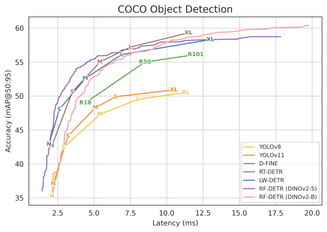
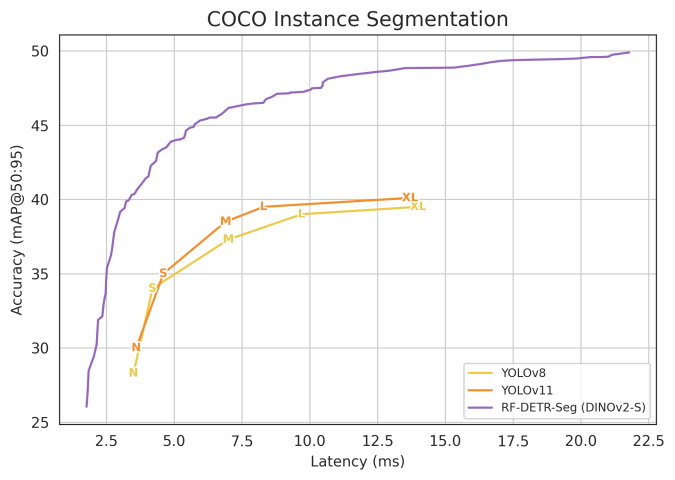
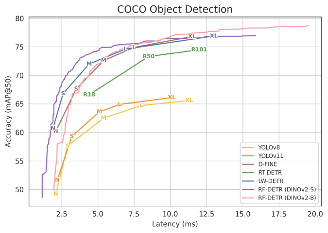
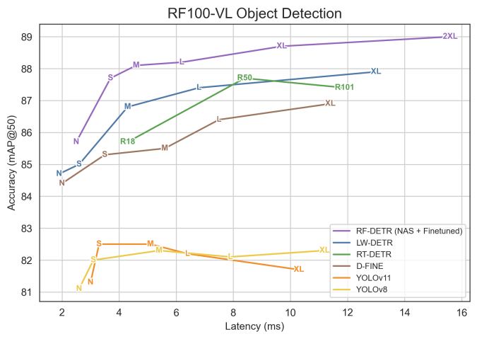
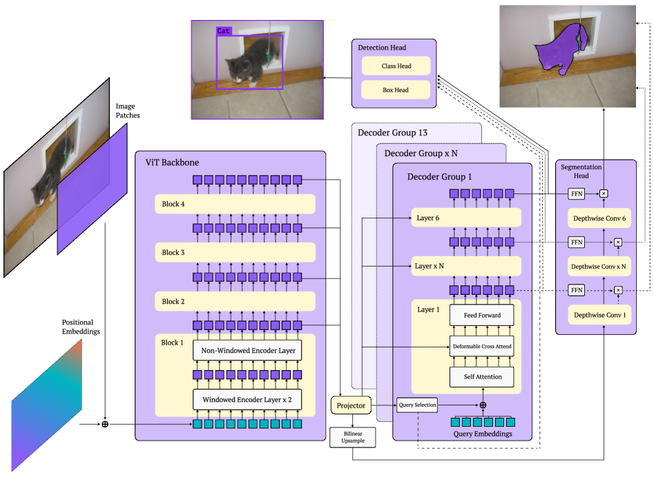
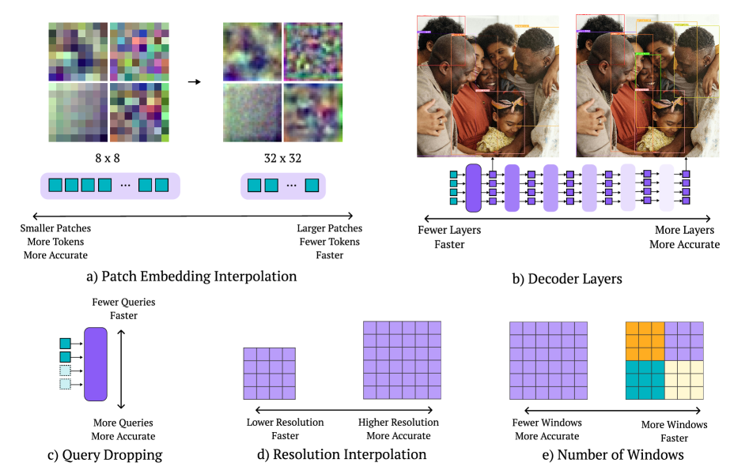
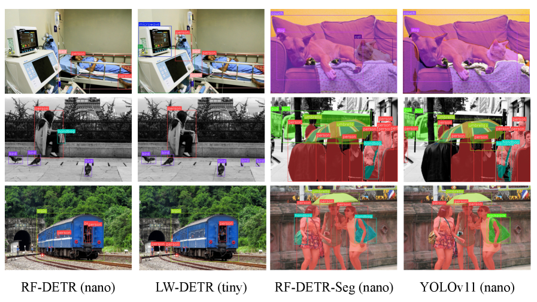

# 论文笔记：RF-DETR: Neural Architecture Search for Real-Time Detection Transformers

## 元信息

| 项目 | 内容 |
|------|------|
| 机构 | Roboflow; Carnegie Mellon University |
| 日期 | February 2026 |
| 项目主页 | https://github.com/roboflow/rf-detr |
| 对比基线 | [[LW-DETR]], [[D-FINE]], [[RT-DETR]], [[Grounding-DINO|GroundingDINO]], [[YOLOv8]], [[YOLOv11]] |
| 链接 | [arXiv](https://arxiv.org/abs/2511.09554) / [Code](https://github.com/roboflow/rf-detr) |

---

## 一句话总结

> 用**权重共享 [[Neural Architecture Search|NAS]]** 微调一个 [[DINOv2]] 预训练的实时 [[DETR]]，单次训练即可在推理时无需重训地导出整条精度-延迟 Pareto 曲线，首次让实时检测器在 COCO 上突破 60 AP。

---

## 核心贡献

1. **首个端到端权重共享 NAS 检测器**: 将 [[Once-for-All|OFA]] 风格的权重共享 NAS 首次引入端到端目标检测与实例分割。单次训练后，可在推理时调节图像分辨率、patch size、窗口数、解码器层数、query 数量等"可调旋钮"，无需重训即可生成数千个不同精度-延迟权衡的子网络（sub-net）。
2. **用互联网级先验现代化 specialist 检测器**: 以 [[DINOv2]] 替换 [[LW-DETR]] 的 [[CAEv2]] backbone，并在 [[Objects365]] 上预训练，使闭集检测器在真实世界小数据集（[[RF100-VL]]）上的迁移能力大幅超越微调后的 [[VLM]]。RF-DETR (2x-large) 在 RF100-VL 上超过 [[Grounding-DINO|GroundingDINO]] (tiny) 1.2 AP，速度快 20 倍。
3. **无调度器（scheduler-free）训练 + 标准化延迟基准**: 摒弃 cosine 学习率调度与激进数据增强（它们隐式偏向 COCO 的数据分布），改用 [[EMA]] 调度；并指出 GPU 功耗节流（power throttling）是延迟测量不可复现的主因，提出"前向间隔 200ms buffer"的标准化测量协议。

---

## 问题背景

### 要解决的问题
如何在**真实世界、分布外（OOD）数据集**上获得高精度的同时保持**实时推理**，并能为不同硬件/数据集快速定制模型大小，而无需为每个配置重新训练。

### 现有方法的局限
- **开放词表检测器（VLM）** 如 [[Grounding-DINO|GroundingDINO]]、[[YOLO-World]]：在 COCO 等常见类别上 zero-shot 表现优异，但对预训练中未出现的 OOD 类别/任务/成像模态泛化差；微调虽能提升域内性能，却因重量级文本编码器牺牲了运行效率与开放词表泛化能力。
- **Specialist（闭集）实时检测器** 如 [[D-FINE]]、[[RT-DETR]]：推理快，但精度低于微调后的 VLM，且**隐式过拟合 COCO**——依赖定制架构、学习率调度器、增强调度器，导致在数据分布差异大的真实数据集上泛化差（如 [[YOLOv8]]）。
- **传统硬件感知 NAS**：每换一个硬件平台都要重复搜索+训练，代价高昂。

### 本文的动机
作者认为，把**互联网级预训练**（DINOv2 + Objects365）与**实时架构**（LW-DETR）结合，再用**权重共享 NAS**解耦训练与搜索，就能一次训练得到一整族 Pareto 最优模型，既泛化到真实数据又能按硬件定制。关键洞见（受 [[Once-for-All|OFA]] 启发）：可以在**训练时**随机采样输入分辨率、patch size 等配置做梯度更新，让所有子网络共享权重并同时收敛，这种"架构增强（architecture augmentation）"还能起到[[正则化|正则化器]]作用。

---

## 方法详解

### 模型架构

RF-DETR 采用 **两阶段 [[DETR]]（two-stage encoder-decoder transformer）** 架构（见 Figure 2），在 [[LW-DETR]] 基础上现代化：

- **输入**: 图像 patches + [[Positional Embedding|位置编码]]
- **Backbone**: 预训练 [[ViT]]（[[DINOv2]]-S 或 DINOv2-B），交错排列**窗口化注意力层（[[Windowed Attention]]）**与非窗口化（全局）注意力层，以平衡精度与延迟。窗口注意力块放在 layer $\{0,1,3,4,6,7,9,10\}$（LW-DETR 放在 $\{0,1,3,6,7,9\}$，RF-DETR 让窗口块**连续**以省去额外 reshape）
- **多尺度投影器（Projector）**: 用 [[Layer Normalization|LayerNorm]] 而非 [[Batch Normalization|BatchNorm]]，从而支持[[梯度累积]]在消费级 GPU 上训练
- **解码器（Decoder）**: 由若干 Decoder Group 组成，每个解码器层含 [[Self-Attention]] + [[Deformable Attention|Deformable Cross-Attention]] + [[Feed-Forward Network|FFN]]；[[Query Selection|query 选择]]提供初始 query embeddings
- **检测头**: Class Head + Box Head，在**所有解码器层**输出上施加检测损失（以支持推理时的 decoder dropout）
- **分割头（RF-DETR-Seg）**: 对编码器输出做[[双线性插值|Bilinear Upsample]]生成像素嵌入图，与各解码器层经 FFN 变换后的 query token 做点积生成分割掩码

### 核心模块

#### 模块1: 端到端权重共享 NAS（5 个可调旋钮）

**设计动机**: 用 [[Once-for-All|OFA]] 式权重共享解耦训练与搜索——每次训练迭代**均匀采样一个随机配置**做梯度更新，相当于用 [[Dropout]] 做集成学习；训练后用网格搜索在验证集上评估所有配置找 Pareto 最优。可调旋钮（见 Figure 3）：

- **Patch Size（patch 大小）**: 小 patch → token 多 → 精度高但更慢。采用 [[FlexiViT]] 式插值在训练中切换 patch size。
- **Number of Decoder Layers（解码器层数）**: 因所有解码器层都加了回归损失，可在推理时丢弃任意（或全部）解码器层。**丢光全部解码器** → RF-DETR 退化为单阶段检测器（类 YOLO 但无 NMS）；去掉最后一层解码器只降 2 mAP 却省 10% 延迟。
- **Number of Query Tokens（query 数量）**: 推理时按 encoder 输出处对应 class logit 的最大 sigmoid 值排序，丢弃低置信度 query，从而控制最大检测数与延迟。Pareto 最优 query 数隐式编码了目标数据集"每图平均物体数"。
- **Image Resolution（图像分辨率）**: 高分辨率利于小物体，低分辨率更快。预分配 $N$ 个位置编码（对应最大分辨率 / 最小 patch size），对较小分辨率/较大 patch 做插值。
- **Number of Windows per Block（每块窗口数）**: 窗口注意力限制自注意力只处理固定数量邻近 token；增减窗口数权衡精度、全局信息混合与计算量。

> 推理时挑选某一配置 = 在 Pareto 曲线上选一个工作点。注意：**参数量相近的配置延迟可能差异巨大**。COCO 上 NAS 挖出的模型几乎无需再微调；RF100-VL 上微调有小幅增益（因小数据集需 >100 epoch 才能让"架构增强"正则收敛）。

#### 模块2: 类 token 与窗口注意力的兼容处理

**设计动机**: [[DINOv2]] backbone 依赖 class token（CAEv2 则无），而窗口注意力会破坏 class token 的全局性。

**具体实现**:
- **为每个窗口复制一份 class token**：全局注意力时窗口级 class token 互相 attend，其余 token attend 所有 class token。
- 因复制 class token 会降低效率，RF-DETR (nano/small/medium) 均用 **2 个窗口**（LW-DETR 最优为 4 窗口）。

#### 模块3: 实时实例分割头（RF-DETR-Seg）

**设计动机**: 受 [[MaskDINO]]（Li et al. 2023）启发但更轻量化以最小化延迟。

**具体实现**:
- 对编码器输出**双线性插值**并学习一个轻量投影器生成像素嵌入图；检测头与分割头**上采样同一张低分辨率特征图**以保证空间一致性。
- 不像 MaskDINO 那样融合多尺度 backbone 特征（为省延迟）。
- 计算所有投影后 query token 嵌入与像素嵌入图的**点积**生成掩码——这些像素嵌入可解释为 [[YOLACT|分割原型（prototype）]]。
- 在 [[Objects365]]（用 [[SAM2]] 伪标注实例掩码）上预训练。

#### 模块4: 无调度器训练 + 标准化延迟评测

**设计动机**: 定制学习率/增强调度器隐式偏向特定数据集特性，损害泛化。

**具体实现**:
- 不用 cosine 调度（其假设固定优化 horizon），改用 [[EMA]] 调度且**省略 learning-rate warmup**；学习率 1e-4（LW-DETR 用 4e-4），梯度裁剪 0.1，DINOv2 backbone 逐层乘性衰减 0.8 以保留预训练知识。
- 增强只用**水平翻转 + 随机裁剪**（禁用 VerticalFlip 等——例如自动驾驶人体检测器不应用垂直翻转，以免水洼倒影造成误检）。
- **batch 级 resize**（而非 LW-DETR 的逐图 resize + padding），减少 padding 像素与窗口伪影。
- 延迟标准化：每次前向间 **buffer 200ms** 抑制 GPU 功耗节流；用同一模型 artifact（同一量化精度）同时报告精度与延迟；TensorRT 中用 CUDA Graphs 预排队 kernel。

---

## 关键公式

> 本文以系统/工程贡献为主，数学公式较少。核心可形式化的机制如下。

### 公式1: [[Neural Architecture Search|权重共享 NAS 训练目标]]

$$
\theta^{*} = \arg\min_{\theta}\ \mathbb{E}_{c \sim \mathcal{U}(\mathcal{C})}\big[\mathcal{L}_{det}\big(f(x;\,\theta,\,c)\big)\big]
$$

**含义**: 每次迭代从配置空间 $\mathcal{C}$ 中**均匀采样**一个子网络配置 $c$，所有子网络共享同一套权重 $\theta$ 并联合优化，等价于带 [[Dropout]] 的集成训练，同时充当"架构增强"正则。

**符号说明**:
- $c \sim \mathcal{U}(\mathcal{C})$: 从可调旋钮笛卡尔积构成的配置空间中均匀采样的一个架构配置（分辨率/patch/窗口/层数/query）
- $\theta$: 所有子网络共享的权重
- $f(x;\theta,c)$: 在配置 $c$ 下对输入 $x$ 的前向
- $\mathcal{L}_{det}$: 检测损失（施加于**所有**解码器层输出）

### 公式2: [[空间位置数|总空间位置数（Spatial Locations）]]

$$
S = \left(\frac{R}{p}\right)^2
$$

**含义**: 论文关键发现——RF-DETR 性能与**总空间位置数 $S$**（而非分辨率或 patch size 单独）更相关。固定分辨率改 patch size，与固定 patch size 改分辨率，结果几乎一致（ViT 在 patchify-project 后对绝对分辨率不敏感）。验证：nano/small/medium 用 patch 27/21/18 + 固定分辨率 640，结果与 Pareto 族几乎相同（patch 27、18 训练时从未见过，证明强泛化）。

**符号说明**:
- $R$: 输入图像分辨率
- $p$: patch size
- $S$: 总空间位置（token）数

### 公式3: 推理时 [[Query Selection|query 丢弃]]排序准则

$$
\text{keep}(q_i) \iff \text{rank}\big(\max_c \sigma(z_{i,c})\big) \le K
$$

**含义**: 推理时按 encoder 输出处每个 query token 的最大类别 logit 的 sigmoid 置信度排序，仅保留 Top-$K$ 个 query，从而无需重训即可减少检测数与延迟。

**符号说明**:
- $z_{i,c}$: 第 $i$ 个 query token 对类别 $c$ 的 logit
- $\sigma$: [[Sigmoid]] 函数
- $K$: 推理时保留的 query 数（如 50/100/200/300）

---

## 关键图表

### Figure 1: Accuracy-Latency Pareto Curve / 精度-延迟 Pareto 曲线

**说明**: 四个子图分别为 COCO 检测 val-set（左上 AP、左下 AP50）、COCO 分割 val-set（右上）、RF100-VL test-set（右下）的实时检测器 Pareto 前沿。RF-DETR（紫/红线）整体压制 [[YOLOv8]]、[[YOLOv11]]、[[D-FINE]]、[[RT-DETR]]、[[LW-DETR]]。RF100-VL 子图中 RF-DETR 系列（86-89 AP50）远高于 YOLO 系列（~81-82），且 YOLO 放大模型也不提升。**关键**: COCO 上整条连续 Pareto 曲线来自**单次训练运行**。

### Figure 2: RF-DETR Architecture / 模型架构

**说明**: 预训练 [[ViT]] backbone（Block 1-4，交错 [[Windowed Attention]]×2 与非窗口编码层）提取多尺度特征 → Projector → Decoder Group（每组含 [[Self-Attention]]、[[Deformable Attention|Deformable Cross-Attend]]、Feed Forward）→ 检测头（Class/Box Head）。分割头与 deformable cross-attention 都对 Projector 输出做 [[双线性插值|Bilinear Upsample]] 以保证特征空间组织一致；检测与分割损失施加于**所有**解码器层以支持推理时 decoder dropout。

### Figure 3: NAS Search Space / NAS 搜索空间

**说明**: 五个可调旋钮的精度-延迟方向示意——(a) patch size（8×8↔32×32，小patch更准更慢）、(b) decoder layers（少层更快）、(c) query dropping（少query更快）、(d) resolution interpolation（高分辨率更准）、(e) number of windows（少窗口更准、多窗口更快）。这种"架构增强"在并行训练数千配置的同时充当正则器、提升泛化。

### Figure 4: Impact of Decoder Layers vs. Query Tokens / 解码器层数 vs query 数

**说明**: RF-DETR (nano) 推理时联合调节 decoder 层数（0-6，颜色）与 query 数（50/100/200/300，标记形状）形成的精度-延迟散点。**关键发现**: 丢弃 100 个最低置信度 query 几乎不降精度，却对所有解码器层都能小幅降延迟；0 层解码器（左下角）延迟最低但精度断崖式下跌（退化为单阶段）。

### Figure 5: Per-Knob Sensitivity Analysis / 单旋钮敏感性（附录 F，无在线图）

**说明**: 分别变化分辨率与 patch size 的两条曲线均呈清晰 Pareto 前沿，与 [[FlexiViT]] 结论一致。**蓝圈=训练时见过的配置，红星=未见配置**——未见配置紧贴已见趋势，证明 RF-DETR 能优雅插值到训练中未出现的新架构。

### Figure 6: Impact of Dataset Characteristics on Tunable Knobs / 数据集特性对旋钮的影响（附录 H，无在线图，数据见 Table 17）

**说明**: RF100-VL 各数据集的对象特性（平均物体大小、类别数、物体密度、标注总数）与架构旋钮（解码器层数、窗口数、query 数、空间分辨率）的相关性散点。整体相关性弱、散布宽，说明最优配置取决于多因素组合而非单一数据集属性。最强相关：**空间位置数 vs 窗口数**（R²=0.492, p<0.001）。

### Figure 7: Ablating Fixed Architecture on RF100-VL / 固定架构消融（附录 I，无在线图，数据见 Table 18）

**说明**: 把 COCO 优化的固定架构迁移到 RF100-VL，仍优于 [[LW-DETR]]；在 RF100-VL 上直接跑 NAS 进一步提升；额外微调对小模型增益尤其明显。"LW-DETR→固定架构"的提升幅度 ≈ "固定架构→NAS 优化"的提升幅度。

### Figure 8: Visualizing Model Predictions / 预测可视化（附录 M，无在线图）

**说明**: 定性对比——RF-DETR (nano) vs [[LW-DETR]] (tiny) 的检测（左），RF-DETR-Seg (nano) vs [[YOLOv11]] (nano) 的分割（右）。RF-DETR 误检更少（如不把路牌误判为人），RF-DETR-Seg 边界更精确。

### Table 1: 标准化延迟评测（Buffering 的影响）

| Method | Reported AP / Lat(ms) | Buffer FP32 AP / Lat | Buffer FP16 AP / Lat |
|--------|------|------|------|
| YOLOv8 (M) | 50.2 / 5.86 | 49.3 / 14.8 | 47.3 / 5.4 |
| YOLOv11 (M) | 51.5 / 4.7 | 49.7 / 18.7 | 48.3 / 5.2 |
| RT-DETR (R18) | 49.0 / 4.61 | 49.0 / 12.2 | 49.0 / 4.4 |
| LW-DETR (M) | 52.5 / 5.6 | 52.6 / 26.8 | 52.6 / 4.4 |
| D-FINE (M) | 55.1 / 5.62 | 55.1 / 13.9 | 55.0 (0.5*) / 5.4 |
| **RF-DETR (M)** | - / - | **54.8 / 20.5** | **54.7 / 4.4** |

**说明**: 加 200ms buffer 后延迟测量更稳定（FP32 下大家都变慢但排序稳定）。D-FINE 朴素量化到 FP16 性能掉到 0.5 AP（需改 ONNX opset 17 修复）。FP16 buffer 列才是公平的"同 artifact"实时对比。

### Table 2: COCO Detection Evaluation（核心检测对比）

| Model | Size | #Params | GFLOPS | Lat(ms) | AP | AP50 | AP75 | APS | APM | APL |
|-------|------|---------|--------|---------|----|----|----|----|----|----|
| YOLOv8 | N | 3.2M | 8.7 | 2.1 | 35.2 | 49.2 | 38.3 | 15.8 | 38.8 | 51.3 |
| YOLOv11 | N | 2.6M | 6.5 | 2.2 | 37.1 | 51.6 | 40.4 | 17.3 | 40.7 | 55.6 |
| YOLOv11 | M | 20.1M | 68.0 | 5.1 | 48.3 | 63.6 | 52.5 | 29.1 | 53.8 | 66.3 |
| GroundingDINO (FT) | T | 173.0M | 1008.3 | 427.6* | 58.2 | - | - | - | - | - |
| LW-DETR | T | 12.1M | 21.4 | 1.9 | 42.9 | 60.7 | 45.9 | 22.7 | 47.3 | 60.0 |
| D-FINE | N | 3.8M | 7.3 | 2.1 | 42.7 | 60.2 | 45.4 | 22.9 | 46.6 | 62.1 |
| **RF-DETR** | **N** | 30.5M | 31.9 | 2.3 | **48.0** | **67.0** | 51.4 | 25.2 | 53.5 | 70.0 |
| D-FINE | S | 10.2M | 25.2 | 3.5 | 50.6 | 67.6 | 55.0 | 32.6 | 54.6 | 66.6 |
| **RF-DETR** | **S** | 32.1M | 59.8 | 3.5 | **52.9** | 71.9 | 57.0 | 32.0 | 58.3 | 73.0 |
| D-FINE | M | 19.2M | 56.6 | 5.4 | **55.0** | 72.6 | 59.7 | 37.6 | 59.4 | 71.7 |
| **RF-DETR** | **M** | 33.7M | 78.8 | 4.4 | 54.7 | 73.5 | 59.2 | 36.1 | 59.7 | 73.8 |
| **RF-DETR** | **2XL** | 126.9M | 438.4 | 17.2 | **60.1** | 78.5 | 65.5 | 43.2 | 64.9 | 76.2 |

**说明**: RF-DETR (nano) 超 D-FINE (nano) 5.3 AP（48.0 vs 42.7）于相近延迟；RF-DETR (nano) 与 YOLOv8/v11 (medium) 性能持平但参数/FLOPs 更大。RF-DETR (2XL) 60.1 AP **首次让实时检测器破 60**。注意 RF-DETR 参数量明显大于 D-FINE，胜在 GFLOPs/延迟而非参数效率。

### Table 3: COCO Instance Segmentation Evaluation

| Model | Size | #Params | GFLOPS | Lat(ms) | AP | AP50 | AP75 |
|-------|------|---------|--------|---------|----|----|----|
| YOLOv11 | N | 2.9M | 10.4 | 3.6 | 30.0 | 47.8 | 31.5 |
| YOLOv11 | M | 22.4M | 123.3 | 6.9 | 38.5 | 60.0 | 40.9 |
| **RF-DETR-Seg** | **N** | 33.6M | 50.0 | 3.4 | **40.3** | 63.0 | 42.6 |
| **RF-DETR-Seg** | **S** | 33.7M | 70.6 | 4.4 | 43.1 | 66.2 | 45.9 |
| FastInst | R50 | 29.7M | 99.7 | 39.6* | 34.9 | 56.0 | 36.2 |
| MaskDINO | R50 | 52.1M | 586 | 242* | 46.3 | 69.0 | 50.7 |
| **RF-DETR-Seg** | **M** | 35.7M | 102.0 | 5.9 | 45.3 | 68.4 | 48.8 |
| **RF-DETR** | **2XL** | 38.6M | 435.3 | 21.8 | 49.9 | 73.1 | 54.5 |

**说明**: RF-DETR-Seg (nano) 超所有 YOLOv8/v11 尺寸，比 [[FastInst]] 高 5.4% 且快近 10×；RF-DETR-Seg (medium) 逼近 [[MaskDINO]] 而延迟仅其零头（5.9ms vs 242ms）。

### Table 4: RF100-VL Evaluation（真实世界泛化，100 数据集平均）

| Model | Size | #Params | GFLOPS | Lat(ms) | AP | AP50 |
|-------|------|---------|--------|---------|----|----|
| YOLOv11 | M | 20.1M | 68.0 | 5.1 | 57.0 | 82.5 |
| GroundingDINO (FT) | T | 173.0M | 1008.3 | 309.9* | 62.3 | 88.8 |
| LLMDet (FT) | T | 173.0M | 1008.3 | 308.4* | 62.3 | 88.3 |
| D-FINE | N | 3.8M | 7.3 | 2.0 | 58.2 | 84.4 |
| **RF-DETR** | **N** | 31.2M | 34.5 | 2.5 | 57.8 | 85.1 |
| **RF-DETR + FT** | **N** | 31.2M | 34.5 | 2.5 | 58.6 | 85.7 |
| **RF-DETR** | **M** | 33.5M | 86.7 | 4.6 | 61.7 | 88.0 |
| **RF-DETR + FT** | **M** | 33.5M | 86.7 | 4.6 | 62.0 | 88.1 |
| **RF-DETR** | **2XL** | 123.5M | 410.2 | 15.6 | **63.3** | 88.9 |
| **RF-DETR + FT** | **2XL** | 123.5M | 410.2 | 15.6 | **63.5** | 89.0 |

**说明**: RF-DETR (2XL) 超 [[Grounding-DINO|GroundingDINO]]/[[LLMDet]] (tiny) 1.0+ AP 而延迟仅 ~1/20。有趣的是 [[RT-DETR]] 在 AP50 上反超基于它的 [[D-FINE]]，说明 D-FINE 超参可能过拟合 COCO。YOLO 系列放大不提升 RF100-VL 性能。

### Table 5: NAS 旋钮消融（在 LW-DETR(M) 基线上逐步叠加）

| 配置 | #Params | GFLOPS | Lat(ms) | AP |
|------|---------|--------|---------|----|
| LW-DETR (M) | 28.2M | 83.7 | 4.4 | 52.6 |
| + Gentler Hyperparameters | 28.2M | 83.7 | 4.4 | 51.6 (-1.0) |
| + DINOv2 Backbone | 32.3M | 78.2 | 4.7 | 53.6 |
| + Additional O365 Pre-Training | 32.3M | 78.2 | 4.7 | 54.3 |
| + Weight Sharing NAS | 32.3M | 78.2 | 4.7 | 54.6 |
| + Patch 14→16, Res 560→640 | 32.3M | 78.5 | 4.7 | 54.4 |
| + Image Resolution 640→576 | 32.2M | 64.2 | 4.0 | 53.6 |
| + #Windows 4→2 | 32.2M | 63.7 | 4.3 | 54.3 |
| + #Decoder Layers 3→4 | 33.7M | 64.8 | 4.4 | 54.6 |
| + #Query Tokens 300→300 | 33.7M | 64.8 | 4.4 | 54.6 |

**关键发现**: gentler 超参（小 batch、低 lr、LayerNorm 替 BatchNorm）单独降 1.0 AP，但换 [[DINOv2]] backbone 重新赚回 2 AP；NAS（"架构增强"）即便 patch14 不在搜索空间也能提升基础配置。最终模型在不增延迟的前提下比 LW-DETR 高 2 AP。

### Table 6: Backbone 消融（LW-DETR(M)+Gentler，60 epoch O365 预训练）

| Backbone | #Params | GFLOPS | Lat(ms) | AP | AP50 |
|----------|---------|--------|---------|----|----|
| CAEv2 ViT/S-16-Truncated | 28.3M | 83.7 | 4.4 | 52.3 | 71.4 |
| **DINOv2 ViT/S-14** | 32.3M | 78.2 | 4.7 | **54.3** | 73.4 |
| SigLIPv2 ViT/B-32* | 105.1M | 81.6 | 4.8 | 50.4 | 70.4 |
| SAM2 Hiera-S* | 44.0M | 109.1 | 11.2 | 53.6 | 72.4 |

**关键发现**: [[DINOv2]] 最优，超 [[CAEv2]] 2.4 AP。[[SAM2]] 的 Hiera-S 虽参数少于 [[SigLIP|SigLIPv2]] 却明显更慢（与 Hiera 宣称的"比 ViT 快"相悖，因 Hiera 未考虑 [[FlashAttention|Flash Attention]] 在 TensorRT 中的高度优化）。

### Table 7 / 8: Pareto 最优配置（附录 A）

**Table 7 (RF-DETR 检测)**: N=分辨率384/patch16/窗2/解码2/query300/DINOv2-S；M=576/16/2/4/300/S；2XL=880/20/2/5/300/DINOv2-B；Max=828/12/1/6/300/B。
**Table 8 (RF-DETR-Seg)**: N=312/12/1/4/query100/S；2XL=768/12/2/6/300/S；Max=890/10/1/6/300/S。分割族 patch size 固定 12（更细），检测族 DINOv2-S 用 16、DINOv2-B 用 20。

### Table 11 / 12: 大模型变体（附录 E）

| Model | Size | #Params | Lat(ms) | AP |
|-------|------|---------|---------|----|
| D-FINE | L | 31M | 7.5 | 57.2 |
| **RF-DETR** | L | 33.9M | 6.8 | 56.5 |
| D-FINE | XL | 62M | 11.5 | 59.3 |
| **RF-DETR** | XL | 126.4M | 11.5 | 58.6 |
| **RF-DETR** | 2XL | 126.9M | 17.2 | **60.1** |
| **RF-DETR** | Max | 132.4M | 98.0 | **61.8** |

**说明**: D-FINE (x-large) 在 mAP 50:95 上略胜 RF-DETR (x-large)，但 RF-DETR (2XL) 反超 D-FINE 0.8 AP 且破 60。DINOv2-B 族随延迟增大与 D-FINE 差距收窄（Table 11：DINOv2-B 在 S/M/L/XL 处差距 -3.1/-1.3/-1.2/-0.7，越大越接近），扩展 RF-DETR 族只需从同一 NAS 搜索采样、无需重训。

### Table 15 / 16: NAS 后微调的影响（附录 G）

**说明**: COCO 上 NAS 后微调收益极小（nano +0.4 AP，medium/large 几乎 +0.0，分割多数"Did Not Improve"）——因 NAS"架构增强"是强正则，去掉它再训练反而过拟合。RF100-VL 上微调收益更明显（需 >100 epoch 收敛）。

### Table 20: Buffering 分析（附录 K）

**说明**: buffer 超过 200ms 不再改变延迟测量（0/200/400/800ms 下 RF-DETR(M)=4.7/4.4/4.4/4.4ms），故 200ms 足矣；但每次前向加 200ms 显著增加总推理时间，未来应找替代方案。

---

## 实验

### 数据集

| 数据集 | 规模 | 特点 | 用途 |
|--------|------|------|------|
| [[COCO]] | 118k train / 5k val | 通用检测/分割旗舰基准 | 训练+评测 |
| [[RF100-VL]] | 100 个多样数据集 | 真实世界、OOD 分布，作为"任意目标域迁移性"代理 | 评测泛化 |
| [[Objects365]] | 大规模 | 用 [[SAM2]] 伪标注实例掩码做预训练 | 预训练 |

### 实现细节

- **Backbone**: [[DINOv2]] ViT-S / ViT-B（预训练权重）
- **优化器**: lr=1e-4，batch size=128，[[EMA]] 调度，**无 warmup**；梯度裁剪 0.1，逐层乘性衰减 0.8
- **增强**: 仅水平翻转 + 随机裁剪；多尺度 0.5-1.5；batch 级 resize
- **训练时配置**: 分辨率 {320…960}(11档)、patch {8,10,12,16,20,24,32}、解码器 6 层、窗口 {1,2,4}、query 300
- **推理时配置**: 解码器可降至 0-6 层、patch 可含未见的 14、query {50,100,200,300}
- **硬件/评测**: NVIDIA T4 GPU + TensorRT 10.4 + CUDA 12.4；FLOPs 用 PyTorch FlopCounterMode
- **搜索规模**: 评估 6,468 个配置（11 分辨率 × 7 patch × 7 解码层 × 3 窗口 × 4 query），约 **10,000 GPU 小时**（200×T4×48h）；总训练时间约为非 NAS 基线的 2-4 倍，但单次训练生成所有尺寸

### 可视化结果

RF-DETR (nano) 比 LW-DETR (tiny) 误检更少（不把路牌误判为人）；RF-DETR-Seg (nano) 比 YOLOv11 (nano) 分割边界更精确（Figure 8）。

---

## 批判性思考

### 优点
1. **工程价值高**: 单次训练导出整条 Pareto 曲线，部署到新硬件无需重训，极大降低多平台优化成本；代码开源、即插即用。
2. **泛化实验扎实**: 在 RF100-VL（100 数据集）上验证真实世界迁移性，并尖锐指出 specialist 检测器"隐式过拟合 COCO"的问题，呼吁社区在多样数据集上评测。
3. **可复现性贡献**: 系统揭示 GPU 功耗节流导致延迟测量不可复现，提出 buffer 协议与"同 artifact 报告精度+延迟"原则，独立开源 benchmark 工具。
4. **优雅的推理时弹性**: 解码器/query 可在推理时无重训丢弃；对未见 patch size/分辨率仍能优雅插值（FlexiViT 式泛化）。

### 局限性
1. **参数量并不小**: RF-DETR (nano) 30.5M 参数 / 31.9 GFLOPs，远大于 D-FINE (nano) 3.8M / 7.3 GFLOPs——"light-weight"主要体现在延迟而非参数/显存，边缘部署仍偏重。
2. **训练成本高**: 10,000 GPU 小时 + 2-4× 训练时长，且需 Objects365 + SAM2 伪标注预训练，小团队难复现完整 pipeline。
3. **延迟测量仍有抖动**: TensorRT 重编译同一 ONNX 会有 ±0.1ms 波动；200ms buffer 不适合测吞吐。
4. **数据集特性→旋钮的关系弱**: Figure 6/Table 17 显示大多数相关性 R² 很低，难以从数据集统计先验地选配置，仍依赖网格搜索。
5. **闭集本质**: 仍是 specialist 检测器，不具备 VLM 的开放词表 zero-shot 能力，每个新数据集仍需微调。

### 潜在改进方向
1. 替代 200ms buffer 的功耗节流缓解方案（论文明确点名）。
2. 探索如何在保留开放词表能力的同时微调 VLM（附录 D 发现朴素微调会抹掉预训练价值）。
3. 扩大 NAS 搜索空间（论文指出所有旋钮都被 Pareto 最优模型用到，暗示扩展有益）。
4. 用更轻量 backbone（ViT-T）或结构化稀疏降低 nano 的参数/显存占用。

### 可复现性评估
- [x] 代码开源（GitHub）
- [x] 预训练模型（Roboflow 发布）
- [x] 训练细节完整（附录 A 含完整超参与采样网格）
- [x] 数据集可获取（COCO、RF100-VL、Objects365 均公开）

---

## 关联笔记

### 基于
- [[LW-DETR]]: 直接基线与起点，RF-DETR 简化其架构与训练流程
- [[Once-for-All|OFA]]: 权重共享 NAS 的核心思想来源
- [[DINOv2]]: backbone 预训练权重，提供互联网级视觉先验
- [[FlexiViT]]: patch size 插值机制来源

### 对比
- [[D-FINE]]: 主要实时检测对比对象（RF-DETR nano 超其 5.3 AP）
- [[RT-DETR]]: 实时 DETR 先驱
- [[Grounding-DINO|GroundingDINO]]: 开放词表 VLM 检测器，RF-DETR 在 RF100-VL 上超越且快 20×
- [[YOLOv8]] / [[YOLOv11]]: NMS-based 实时检测器对比
- [[MaskDINO]] / [[FastInst]]: 实例分割对比

### 方法相关
- [[Neural Architecture Search]]: 核心方法
- [[Windowed Attention]]: backbone 关键组件
- [[Deformable Attention]]: 解码器交叉注意力
- [[EMA]]: 无调度器训练的关键
- [[SAM2]]: Objects365 实例掩码伪标注

### 硬件/数据相关
- [[RF100-VL]]: 真实世界泛化评测基准（同作者团队）
- [[Objects365]]: 预训练数据集
- [[COCO]]: 主评测基准

---

## 速查卡片

> [!summary] RF-DETR: NAS for Real-Time Detection Transformers
> - **核心**: 权重共享 NAS + DINOv2 预训练，单次训练导出整条精度-延迟 Pareto 曲线
> - **方法**: 训练时随机采样 5 个"旋钮"配置（分辨率/patch/窗口/解码层/query），推理时无重训挑工作点
> - **结果**: COCO nano 48.0 AP（超 D-FINE 5.3），2XL 60.1 AP（首个破 60 的实时检测器）；RF100-VL 超 GroundingDINO 且快 20×
> - **代码**: https://github.com/roboflow/rf-detr

---

*笔记创建时间: 2026-06-10*
